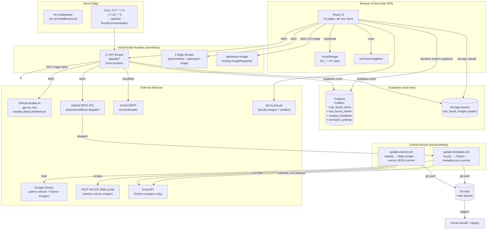
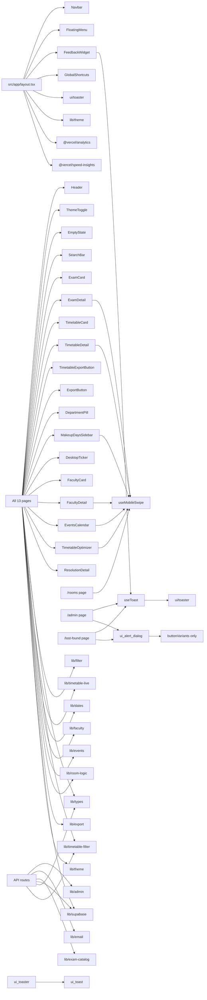

# 01 — System Architecture

## 1. Stack & Framework

| Layer | Technology | Source |
|-------|-----------|--------|
| Framework | Next.js 14.2 (App Router only — Pages Router `_document.tsx` is dead code) | `package.json:58`; `src/pages/_document.tsx:1-13` (unused) |
| Language | TypeScript 5 (strict mode, `moduleResolution: 'bundler'`) | `tsconfig.json:1-41` |
| React | 18.3 | `package.json:62-64` |
| Styling | Tailwind CSS 3.4 + `tailwindcss-animate`; `darkMode: ['selector', '[data-theme="dark"]']` | `tailwind.config.ts:1-67` |
| CSS tokens | Dual system: custom hex (`--color-bg`, `--accent-cs`, …) + Shadcn oklch (`--background`, `--primary`, …) | `src/styles/globals.css:8-521` |
| Fonts | DM Sans (body), DM Mono / JetBrains Mono (mono/clock), Instrument Serif (display) — via `next/font/google` (also redundantly `@import`ed in `globals.css:1`) | `src/app/layout.tsx:13-37` |
| UI primitives | Radix UI (12 packages) + custom shadcn-style wrappers in `src/components/ui/` | `package.json:19-43` |
| Forms | react-hook-form 7.76 + @hookform/resolvers 5.2 + zod 4.4 | `package.json:18,75,65` |
| Animations | framer-motion 12.38 + tailwindcss-animate + 14 custom keyframes in `globals.css` | `package.json:55` |
| Icons | lucide-react 1.16 + inline SVGs | `package.json:57` |
| Image compression | browser-image-compression 2.0 (client-side, for lost-found photos) | `package.json:48` |
| Excel | exceljs 4.4 + xlsx 0.18 + file-saver 2.0 (dynamic-imported) | `package.json:53,73,54` |
| Calendar | react-day-picker 10 (unused?) + custom ICS generation | `package.json:63` |
| Charts | recharts 3.8 (unused?) | `package.json:67` |
| DB | Supabase JS 2.105 (Postgres + Storage) + raw `pg` 8.21 (only in `scripts/setup-settings-db.ts`) | `package.json:44,61` |
| Email | Nodemailer 8.0 (Gmail SMTP) + Resend 6.12 (declared but unused) | `package.json:60,68` |
| Analytics | @vercel/analytics 2 + @vercel/speed-insights 2 | `package.json:46-47` |

**Runtime config:** `next.config.js:1-15` — `compress: true`, `poweredByHeader: false`, sets `Cache-Control: public, max-age=3600, stale-while-revalidate=86400` on `/data/:path*` (build-time static JSON assets).

## 2. System Architecture Diagram

### Mermaid



### ASCII Fallback

```
┌─────────────────────────────────────────────────────────────────────────────┐
│                            BROWSER (Client SPA)                              │
│  ┌────────────────────────────┐  ┌──────────────────────────────────────┐  │
│  │ 13 React pages             │  │ Global mounts (layout.tsx):          │  │
│  │ (all 'use client')         │  │   <Navbar/> (desktop pill nav)       │  │
│  │                            │  │   <FloatingMenu/> (mobile arc FAB)   │  │
│  │ Build-time JSON imports:   │  │   <FeedbackWidget/> (right edge)     │  │
│  │   timetable.json (53k)     │  │   <GlobalShortcuts/> (Ctrl+Shift+A)  │  │
│  │   regular_schedule.json    │  │   <Toaster/> (Radix)                 │  │
│  │   summer_schedule.json     │  │   <Analytics/> + <SpeedInsights/>    │  │
│  │   semester_calendar.json   │  └──────────────────────────────────────┘  │
│  │   student_events.json      │                                            │
│  │   faculty/faculty_data.json│  localStorage: fsc_* + lf-* (15+ keys)    │
│  └─────────────┬──────────────┘  useToast: module-scope singleton         │
└────────────────┼────────────────────────────────────────────────────────┘
                 │ fetch (browser)
                 ▼
┌─────────────────────────────────────────────────────────────────────────────┐
│                      VERCEL EDGE (no middleware)                             │
│   Cron triggers:                                                             │
│     • 0 5 * * 1-5  → /api/lost-found/cron/reminders                          │
│     • 0 13 * * 0   → /api/lost-found/cron/reminders                          │
└─────────────────────────────────────────────────────────────────────────────┘
                 │
                 ▼
┌─────────────────────────────────────────────────────────────────────────────┐
│             VERCEL SERVERLESS (Node runtime, force-dynamic)                  │
│   17 API routes under src/app/api/:                                          │
│     • schedule (edge)         • export-image (edge, next/og)                │
│     • timetable (supabase)    • smart-search (GitHub AI)                    │
│     • feedback + [id]         • admin/{check,login,logout,refetch-timetable}│
│     • lost-found (root)       • lost-found/[id] (+ /resolution)             │
│     • lost-found/verify       • lost-found/handoff (reads docs/campus_map.md)│
│     • lost-found/claim/* (5 sub-routes)                                      │
│     • lost-found/cron/reminders                                              │
└──────┬────────────────┬────────────────┬────────────────┬──────────────────┘
       │                │                │                │
       ▼                ▼                ▼                ▼
┌─────────────┐  ┌────────────┐  ┌────────────┐  ┌────────────────────────┐
│  Supabase   │  │ GitHub AI  │  │  Gmail     │  │  GitHub REST API       │
│  (anon key) │  │ gpt-4o-mini│  │  SMTP      │  │  (workflow dispatch)   │
│             │  │            │  │            │  │                        │
│ 4 tables:   │  │ 4 callers: │  │ 5 fns in   │  │ Triggers:              │
│  • lf_items │  │  • smart-  │  │ email.ts   │  │  • admin/refetch-      │
│  • lf_claims│  │    search  │  │ (silent    │  │    timetable           │
│  • feedback │  │  • verify  │  │  no-op if  │  │                        │
│  • settings │  │  • handoff │  │  env unset)│  │ → update-timetable.yml │
│             │  │  • sync    │  │            │  │   (hourly Python)      │
│ Storage:    │  │            │  │            │  │                        │
│  lf_images  │  │            │  │            │  │ Workflow → git push    │
│  (public)   │  │            │  │            │  │  → Vercel auto-rebuild │
└─────────────┘  └────────────┘  └────────────┘  └────────────────────────┘

┌─────────────────────────────────────────────────────────────────────────────┐
│                  GITHUB ACTIONS (CI/CD pipelines)                            │
│  update-timetable.yml (hourly, cron: '0 * * * *'):                           │
│    → Python: scripts/run_parser.py → all_courses_schedule.py                 │
│    → reads Supabase semester_settings to pick semester type                  │
│    → fetches Google Sheets via GOOGLE_SHEETS_API_KEY                          │
│    → optional LLM cleanup via GROQ_API_KEY                                    │
│    → writes public/data/timetable.json                                        │
│    → commits to main with "chore: auto-update timetable.json"                │
│    → triggers Vercel redeploy                                                 │
│                                                                               │
│  update-events.yml (weekly, Mon 06:00 UTC):                                   │
│    → Python: scripts/scrape_slate.py (auth: SLATE_USERNAME/PASSWORD)          │
│    → Python: scripts/filter_events.py (LLM filter via GROQ_API_KEY)           │
│    → writes public/data/{slate_calendar_events,student_events}.json           │
│    → commits to main with "chore: auto-update student events"                │
└─────────────────────────────────────────────────────────────────────────────┘
```

## 3. Build Pipeline

Per `package.json:5-15`:

```
prebuild → ts-node scripts/run-exam-parser.ts
   ├─ reads Supabase semester_settings (or runs both parsers as fallback if no env)
   ├─ if regular → scripts/parse-excel.ts → public/data/regular_schedule.json
   └─ if summer  → scripts/parse-summer-exam.ts → public/data/summer_schedule.json
              (also runs the OTHER parser as fallback for safety)

build → next build
dev → ts-node scripts/run-exam-parser.ts && next dev
```

The `prebuild` hook runs before EVERY `next build` and EVERY `next dev` (via the `dev` script). This regenerates exam schedule JSON from `exam_schedule.xlsx` / `exam_schedule_summer.xlsx` based on current Supabase semester settings.

Three additional npm scripts for one-off operations:
- `timetable:update` — runs `all_courses_schedule.py` + copies `timetable.json` to `public/data/`
- `events:scrape` — runs `scripts/scrape_slate.py`
- `events:filter` — runs `scripts/filter_events.py`
- `events:update` — both in sequence

## 4. Deployment Configuration

### Vercel

Per `vercel.json:1-12`:

```json
{
  "crons": [
    {
      "path": "/api/lost-found/cron/reminders",
      "schedule": "0 5 * * 1-5"      // Mon–Fri 05:00 UTC (10:00 PKT)
    },
    {
      "path": "/api/lost-found/cron/reminders",
      "schedule": "0 13 * * 0"       // Sun 13:00 UTC (18:00 PKT)
    }
  ]
}
```

Vercel auto-detects Next.js framework. No `vercel.json` build config overrides — default Next.js build pipeline applies. Environment variables (configured in Vercel dashboard, not in repo):

| Env Var | Set In | Used By | Purpose |
|---------|--------|---------|---------|
| `NEXT_PUBLIC_SUPABASE_URL` | Vercel + GitHub Actions | `src/lib/supabase.ts`, Python scripts | Supabase project URL (also baked into client bundle via `NEXT_PUBLIC_*`) |
| `NEXT_PUBLIC_SUPABASE_ANON_KEY` | Vercel + GitHub Actions | `src/lib/supabase.ts`, Python scripts | Supabase anon key — public RLS only |
| `ADMIN_USERNAME` | Vercel | `src/lib/admin.ts` | Admin login username |
| `ADMIN_PASSWORD` | Vercel | `src/lib/admin.ts` | Admin login password (plain string compare) |
| `GITHUB_TOKEN` | Vercel | 4 API routes | Bearer token for GitHub Models AI + workflow dispatch |
| `GMAIL_USER` | Vercel | `src/lib/email.ts` | Gmail SMTP sender |
| `GMAIL_APP_PASSWORD` | Vercel | `src/lib/email.ts` | Gmail SMTP app password |
| `CRON_SECRET` | Vercel | `api/lost-found/cron/reminders` | Bearer token for cron auth (production only) |
| `GOOGLE_SHEETS_API_KEY` | GitHub Actions | Python scrapers | Google Sheets read access |
| `GROQ_API_KEY` | GitHub Actions | Python scrapers | Groq LLM API for timetable/event cleanup |
| `SLATE_USERNAME` | GitHub Actions | `scrape_slate.py` | FAST Slate portal auth |
| `SLATE_PASSWORD` | GitHub Actions | `scrape_slate.py` | FAST Slate portal auth |
| `SLATE_TOOL_BASE` | GitHub Actions | `scrape_slate.py` | Slate tool URL base |
| `MAIN_PUSH_TOKEN` | GitHub Actions | workflow `checkout@v4` | PAT for git push to main |
| `DATABASE_URL` / `POSTGRES_URL` / `POSTGRES_PRISMA_URL` | local only | `scripts/setup-settings-db.ts` | Direct Postgres connection for one-off DB setup script |

### GitHub Actions

`.github/workflows/update-timetable.yml` — hourly at `0 * * * *`, only on `main`:
1. Checkout with `MAIN_PUSH_TOKEN`
2. Setup Python 3.11
3. Run `python3 scripts/run_parser.py` (which dispatches `all_courses_schedule.py`)
4. Copy `timetable.json` to `public/data/`
5. Git commit if changed (`chore: auto-update timetable.json [timestamp]`)
6. Git push → triggers Vercel rebuild

`.github/workflows/update-events.yml` — weekly Mon 06:00 UTC:
1. Checkout with `MAIN_PUSH_TOKEN`
2. Setup Python 3.11
3. Install `requests beautifulsoup4 lxml`
4. Run `npm run events:update` (= scrape_slate.py + filter_events.py)
5. Git commit if changed (`chore: auto-update student events [timestamp]`)
6. Git push → triggers Vercel rebuild

Both workflows are visible in the git log via the recurring `chore: auto-update ...` commits by `github-actions[bot]`.

## 5. Component Dependency Graph (frontend imports)



## 6. Architectural Patterns & Tech Debt

### Patterns in use

| Pattern | Implementation | Notes |
|---------|----------------|-------|
| App Router with co-located API | `src/app/{page.tsx,api/...}` | All 13 pages are `'use client'` — no server components. Only 2 API routes use `runtime = 'edge'`. |
| Build-time JSON bundling | `require('../../public/data/...')` at module scope | 7 pages use this pattern; data updates require Vercel rebuild (auto-triggered by GitHub Actions commits) |
| Serverless function per route | One `route.ts` per `app/api/<path>/` | 17 routes total, all `dynamic = 'force-dynamic'` except `schedule` (edge cached) |
| Client-side state in localStorage | `fsc_*` and `lf-*` keys | 15+ keys; no cleanup logic; some grow unbounded (`lf-view-counts`, `lf-item-claims-${id}`) |
| Custom auth (cookie-based) | `admin_session` cookie, base64 of `username:password` | No JWT, no rotation, no CSRF, no rate-limit |
| Mobile-drawer pattern | `useMobileSwipe` hook shared by 6 detail components | Boilerplate duplicated 6× (closeDrawer, body scroll lock, Escape handler, drawer className) — should be extracted to `<DetailDrawer>` wrapper |
| Module-scope singletons | `useToast` (`memoryState` + `listeners`) | Allows `toast()` to be called from outside React (used by FeedbackWidget) |
| Dual-tree mobile/desktop rendering | 6 pages render entirely separate trees via `md:hidden` / `hidden md:flex` | Doubles bundle size for those pages |

### Inconsistencies / Tech Debt

| Issue | Files affected | Severity |
|-------|----------------|----------|
| FAST PM heuristic duplicated 4× | `lib/timetable-filter.ts`, `lib/room-logic.ts`, `lib/dates.ts`, `lib/timetable-filter.ts` | Medium — should centralize |
| Mobile-drawer boilerplate duplicated 6× | FacultyDetail, TimetableDetail, ExamDetail, MakeupDaysSidebar, EventsCalendar, TimetableOptimizer | Medium |
| `ExportButton` + `TimetableExportButton` 70% duplicate | `src/components/{ExportButton,TimetableExportButton}.tsx` | Low |
| `DesktopTicker` duplicates sheet-date resolution algorithm | `src/components/DesktopTicker.tsx:86-295` (~210 lines) duplicates logic in `timetable/page.tsx` | Medium |
| 6 of 11 UI primitives are dead code | `ui/{progress,avatar,scroll-area,aspect-ratio,tooltip,dialog,input}.tsx` | Low (cleanup) |
| `ui/sonner.tsx` would crash on import | Imports `next-themes` (not in `package.json`) | Low — safe only because never imported |
| `_document.tsx` is dead Pages Router code | `src/pages/_document.tsx` | Low (cleanup) |
| Two parallel CSS token systems | `globals.css` (custom hex + Shadcn oklch) | Low — components must consciously pick |
| 3 dark-mode entry paths (only 2 trigger Tailwind `dark:`) | `[data-theme="dark"]` (JS) + `@media (prefers-color-scheme: dark) :root:not([data-theme="light"])` (system) + Tailwind `dark:` variant | Low-medium — system-dark users get partial dark mode |
| `TOAST_REMOVE_DELAY = 1000000` (16.7 min) in `use-toast.ts:12` | Likely typo for `1000` (1 sec) | Low — masked by `TOAST_LIMIT = 1` |
| `matchesSummerCourse` Strategy 3 effectively unreachable | `src/lib/filter.ts:115-130` | Low — fallthrough is graceful |
| `sortByChronological` uses 12-h `parseTime` instead of `parseTime24` | `src/lib/dates.ts:108-117` | Medium — same-day exam sort order wrong for 24-h times |
| Stale URL in email.ts | `lib/email.ts:31` — `'https://fast-isb-exams.vercel.app'` instead of `'https://fast-nuces-isb.vercel.app'` | High — verification links in emails point to wrong deployment |
| `ResolutionDetail` imports type from page file | `src/components/ResolutionDetail.tsx:16` imports from `@/app/lost-found/page` | Low — brittle coupling |
| `DepartmentPill` accent map hardcoded for 11 depts | `src/components/DepartmentPill.tsx:7-19` | Low — must edit CSS vars + this map for new dept |
| `timetable-live.ts` only used by 1 importer | `DesktopTicker` | Low — could be merged into `timetable-filter.ts` |
| Hardcoded admin identity in admin page | `src/app/admin/page.tsx:931,624` — `"ammarasad321993"` regardless of actual login | Medium — fake audit trail |
| No error boundaries | None of 13 pages wrap children | Medium — single thrown error crashes whole page |
| `lost-found/page.tsx` polls every 30s indefinitely | `src/app/lost-found/page.tsx:6423` | Low-medium — battery drain on mobile |
| `TimetableOptimizer` exponential backtracking with no early-termination | `src/components/TimetableOptimizer.tsx:411-578` | Medium — could hang browser for large course counts |
| `verify-hold` endpoint allows anonymous self-verification | `src/app/api/lost-found/claim/verify-hold/route.ts` | High ⚠️ SECURITY — anyone with claimId UUID can self-resolve |
| `lost-found/[id]` PATCH generic branch anonymous | `src/app/api/lost-found/[id]/route.ts:191-326` | High ⚠️ SECURITY — anyone can mutate any item's fields |
| `smart-search` accepts arbitrary client-supplied `items` array | `src/app/api/smart-search/route.ts:5-105` | Medium ⚠️ — prompt-injection vector via crafted item payloads |

## 7. Security Posture Summary

⚠️ See `10-ERROR-HANDLING-AND-EDGE-CASES.md` § Security for full details.

| Concern | Status |
|---------|--------|
| Admin auth | Cookie-based, base64 of `username:password`, no rotation, no rate-limit, no CSRF. Token is constant per-deploy. |
| Public DB writes (lost-found) | Supabase RLS allows public INSERT/UPDATE/DELETE on `lost_found_items` and `lost_found_claims`. Server uses anon key — no service-role bypass. |
| Anonymous item mutation | `PATCH /api/lost-found/[id]` generic branch has no auth check — title/description/location/contactInfo/category/imageUrl/isResolved can be overwritten by anyone. |
| AI-driven DB mutations | `POST /api/lost-found/verify` allows anonymous callers to drive auto-resolution of items via AI image verification (≥75 confidence). |
| Email leak | `sendClaimRecordedEmail` and 2 sibling functions embed ALL claimer emails in body — visible to every recipient. |
| SSRF | `POST /api/lost-found/verify` fetches `originalImageUrl` server-side with no allowlist. |
| Stale email URLs | All email verification links point to `https://fast-isb-exams.vercel.app/lost-found?verifyClaimId=...` — wrong deployment alias. |
| Cron auth | Only enforced when `NODE_ENV === 'production'`. Dev mode is open. |
| Hidden admin shortcut | `Ctrl+Shift+A` global keyboard shortcut navigates to `/admin` (undocumented in UI). |
