# 02 — Routing & Navigation

## 1. Route Inventory

All routes use Next.js App Router (`src/app/`). No middleware exists (`src/middleware.ts` absent). No route groups. No dynamic page routes (only API routes use `[id]` dynamic segments).

| Route | File | Auth | Render | Notes |
|-------|------|------|--------|-------|
| `/` | `src/app/page.tsx:1-531` | public | `'use client'` | Landing — 8 feature cards, live ticker, social links |
| `/home` | `src/app/home/page.tsx:1-1236` | public | `'use client'` | Tabbed shell for timetable/exams/rooms/faculty feature configuration |
| `/schedule` | `src/app/schedule/page.tsx:1-243` | public | `'use client'` | Exam list (filtered by `?batch&school&dept` or `?batch=Summer`) |
| `/timetable` | `src/app/timetable/page.tsx:1-1637` | public | `'use client'` | Weekly class schedule (filtered by `?batch&dept&section`) |
| `/timetable/custom` | `src/app/timetable/custom/page.tsx:1-1520` | public | `'use client'` | Custom multi-bundle timetable builder |
| `/timetable/optimizer` | `src/app/timetable/optimizer/page.tsx:1-47` | public | `'use client'` | CSP solver for clash-free section combos (thin shell around `TimetableOptimizer` component) |
| `/custom` | `src/app/custom/page.tsx:1-891` | public | `'use client'` | Custom exam builder (companion to `/timetable/custom`) |
| `/semester` | `src/app/semester/page.tsx:1-544` | public | `'use client'` | Academic calendar with key dates, holidays, monthly grids |
| `/faculty` | `src/app/faculty/page.tsx:1-413` | public | `'use client'` | Faculty directory with dept filter, search, pagination |
| `/rooms` | `src/app/rooms/page.tsx:1-633` | public | `'use client'` | Free-rooms finder (specific slot OR full-week calendar) |
| `/events` | `src/app/events/page.tsx:1-382` | public | `'use client'` | Campus events monthly calendar with ICS export |
| `/lost-found` | `src/app/lost-found/page.tsx:1-6553` | public | `'use client'` + `dynamic='force-dynamic'` | Lost & Found marketplace — list/detail/report/history/resolution sub-views |
| `/admin` | `src/app/admin/page.tsx:1-1821` | gated (cookie) | `'use client'` | Admin console — login screen + 3 tabs (items/feedback/settings) |

**API routes** (17 total, all under `src/app/api/`) — see `03-API-REFERENCE.md` for full details.

## 2. Layout & Global Mounts

`src/app/layout.tsx:62-88` — root layout wraps every page with:

```tsx
<html lang="en" className={`${dmSans.variable} ${dmMono.variable} ${instrumentSerif.variable} ${jetbrainsMono.variable}`} suppressHydrationWarning>
  <body className="bg-[var(--color-bg)] text-[var(--color-text-primary)] font-body antialiased">
    <ThemeProvider>
      {children}
      <Navbar />              {/* desktop-only floating pill nav */}
      <FloatingMenu />        {/* mobile-only circular arc FAB */}
      <FeedbackWidget />      {/* right-edge feedback trigger */}
      <GlobalShortcuts />     {/* Ctrl+Shift+A → /admin, Ctrl+Shift+Z → back */}
      <Toaster />             {/* Radix toast portal */}
    </ThemeProvider>
    <Analytics />             {/* @vercel/analytics */}
    <SpeedInsights />        {/* @vercel/speed-insights */}
  </body>
</html>
```

**Metadata** (set once in layout, no per-page overrides):
- Title: `'FAST Isb Utilities'`
- Description: `'Find your weekly and exam schedules — FAST NUCES, Islamabad'`
- Icon: `/logo/icon.png`
- Theme color: `#FAFAF8`
- OpenGraph: `title='FAST Isb Utilities'`, `description='Find your weekly and exam schedules instantly'`, `type='website'`

## 3. Navigation Graph

### Mermaid

```mermaid
graph TD
  Root["/ (Landing)"]

  Root -.->|click feature card 'timetable'| HomeTimetable["/home?feature=timetable"]
  Root -.->|click feature card 'optimizer'| Optimizer["/timetable/optimizer"]
  Root -.->|click feature card 'exams'| HomeExams["/home?feature=exams"]
  Root -.->|click feature card 'rooms'| HomeRooms["/home?feature=rooms"]
  Root -.->|click feature card 'faculty'| HomeFaculty["/home?feature=faculty"]
  Root -.->|click feature card 'semester'| Semester["/semester"]
  Root -.->|click feature card 'events'| Events["/events"]
  Root -.->|click feature card 'lost-found'| LostFound["/lost-found"]
  Root -.->|footer 🔑| Admin["/admin"]
  Root -.->|Ctrl+Shift+A| Admin

  HomeTimetable -.->|default mode CTA| Timetable["/timetable?batch&dept&section"]
  HomeTimetable -.->|custom mode CTA| TimetableCustom["/timetable/custom"]
  HomeExams -.->|default mode CTA| ScheduleReg["/schedule?batch&school&dept"]
  HomeExams -.->|summer mode CTA| ScheduleSummer["/schedule?batch=Summer"]
  HomeExams -.->|custom mode CTA| Custom["/custom"]
  HomeRooms -.->|CTA| Rooms["/rooms"]
  HomeFaculty -.->|CTA| Faculty["/faculty"]

  HomeAny["/home (any tab)"] -.->|back button| Root
  HomeAny -.->|faculty quick-button| FacultyWithDept["/faculty?dept=X"]
  HomeAny -.->|Ctrl+Shift+Z| Root

  ScheduleReg -.->|back| Root
  ScheduleReg -.->|change filters| Root
  ScheduleSummer -.->|back| Root
  ScheduleSummer -.->|change courses| Root

  Timetable -.->|back| Root
  Timetable -.->|change filters| Root
  Timetable -.->|preview from optimizer| TimetableCustom
  TimetableCustom -.->|back| Root
  Optimizer -.->|back| Root
  Optimizer -.->|preview option| TimetableCustom
  Custom -.->|back| Root
  Semester -.->|back| Root
  Faculty -.->|back| Root
  Rooms -.->|back| Root
  Events -.->|back| Root

  LostFound -.->|back| Root
  LostFound -.->|REPORT AN ITEM| LFReport["/lost-found (subView=report)"]
  LostFound -.->|click item card| LFDetail["/lost-found (subView=detail)"]
  LostFound -.->|HISTORY button| LFHistory["/lost-found (subView=history)"]
  LFDetail -.->|view resolution| LFResolution["/lost-found (subView=resolution)"]
  LFDetail -.->|back to list| LostFound
  LFReport -.->|cancel| LostFound
  LFHistory -.->|back to list| LostFound
  LFResolution -.->|back to history| LFHistory

  Admin -.->|footer 🔑 back to portal| LostFound
  Admin -.->|login success| AdminDash["/admin (authenticated)"]
  AdminDash -.->|Exit Portal| LostFound

  Root -.->|Navbar ROOMS| Rooms
  Root -.->|Navbar LOST & FOUND| LostFound
  Root -.->|Navbar HOME| Root
  Root -.->|Navbar FACULTY| Faculty
  Root -.->|Navbar COURSES| TimetableCustom

  Root -.->|FloatingMenu item| HomeAny
  Root -.->|FloatingMenu item| TimetableCustom
  Root -.->|FloatingMenu item| Rooms
  Root -.->|FloatingMenu item| Faculty
  Root -.->|FloatingMenu item| Optimizer
  Root -.->|FloatingMenu item| HomeExams
  Root -.->|FloatingMenu item| Semester

  Admin -.unauthenticated OR any protected action without cookie-.-> AdminLogin["/admin (login screen)"]
```



### Plain-Text Edge List (redundancy for renderers without Mermaid)

```
# From Landing (/)
[/] --click:"Timetable card"--> [/home?feature=timetable]
[/] --click:"Timetable Optimizer card"--> [/timetable/optimizer]
[/] --click:"Exam Finder card"--> [/home?feature=exams]
[/] --click:"Free Rooms card"--> [/home?feature=rooms]
[/] --click:"Faculty Info card"--> [/home?feature=faculty]
[/] --click:"Semester Schedule card"--> [/semester]
[/] --click:"Campus Events card"--> [/events]
[/] --click:"Lost & Found card"--> [/lost-found]
[/] --click:"footer 🔑"--> [/admin]
[/] --keyboard:"Ctrl+Shift+A"--> [/admin]
[/] --click:"GitHub link"--> [external: github.com/ammarasad2005/FAST-Utilities]
[/] --click:"LinkedIn link"--> [external: linkedin.com/in/muhammad-ammar-asad]

# From /home (timetable tab)
[/home?feature=timetable] --click:"CTA (default mode)"--> [/timetable?batch=X&dept=Y&section=Z]
[/home?feature=timetable] --click:"CTA (custom mode)"--> [/timetable/custom]
[/home?feature=timetable] --click:"faculty quick-button"--> [/faculty?dept=X]

# From /home (exams tab)
[/home?feature=exams] --click:"CTA (default mode, regular semester)"--> [/schedule?batch=X&school=Y&dept=Z]
[/home?feature=exams] --click:"CTA (summer mode)"--> [/schedule?batch=Summer]
[/home?feature=exams] --click:"CTA (custom mode)"--> [/custom]

# From /home (rooms tab)
[/home?feature=rooms] --click:"CTA"--> [/rooms]

# From /home (faculty tab)
[/home?feature=faculty] --click:"CTA"--> [/faculty]
[/home?feature=faculty] --click:"faculty quick-button"--> [/faculty?dept=X]

# From any /home tab
[/home] --click:"back button"--> [/]
[/home] --keyboard:"Ctrl+Shift+Z"--> [browser back]

# From /schedule
[/schedule] --click:"back button"--> [browser back]
[/schedule] --click:"Change filters/courses"--> [/]
[/schedule] --click:"exam card"--> [/schedule (ExamDetail drawer, no route change)]

# From /timetable
[/timetable] --click:"back button"--> [browser back]
[/timetable] --click:"Change filters"--> [/]
[/timetable] --click:"class card"--> [/timetable (TimetableDetail drawer, no route change)]
[/timetable] --click:"Makeup Days button"--> [/timetable (MakeupDaysSidebar drawer, no route change)]

# From /timetable/custom
[/timetable/custom] --click:"back button"--> [/]
[/timetable/custom] --click:"class card"--> [/timetable/custom (TimetableDetail drawer)]
[/timetable/custom] --localStorage:"fsc_timetable_preview" handoff--> [/timetable/custom (loaded from preview)]

# From /timetable/optimizer
[/timetable/optimizer] --click:"back button"--> [/]
[/timetable/optimizer] --click:"Preview Timetable link (per result option)"--> [/timetable/custom (with fsc_timetable_preview set)]

# From /custom
[/custom] --click:"back button"--> [/]
[/custom] --click:"exam card"--> [/custom (ExamDetail drawer)]

# From /semester (no interactive navigation — purely display)
[/semester] --click:"back button"--> [/]

# From /faculty
[/faculty] --click:"back button"--> [/]
[/faculty] --click:"dept button"--> [/faculty (filtered, no route change)]
[/faculty] --click:"faculty card"--> [/faculty (FacultyDetail drawer)]
[/faculty] --URL:"?dept=X" on mount--> [/faculty (filtered)]

# From /rooms
[/rooms] --click:"back button"--> [/]
[/rooms] --click:"Find Free Rooms"--> [/rooms (SpecificResults view, no route change)]
[/rooms] --click:"Generate Full Calendar"--> [/rooms (CalendarGrid view)]
[/rooms] --click:"calendar cell"--> [/rooms (RoomDetail drawer)]

# From /events
[/events] --click:"day cell"--> [/events (EventDayDetail drawer via portal)]
[/events] --click:"Add to calendar (per event)"--> [downloads .ics, no route change]
[/events] --click:"back button"--> [/]

# From /lost-found (subView state machine — all under same route)
[/lost-found] --click:"REPORT AN ITEM"--> [/lost-found (subView=report)]
[/lost-found] --click:"HISTORY button"--> [/lost-found (subView=history)]
[/lost-found] --click:"item card"--> [/lost-found (subView=detail)]
[/lost-found] --click:"back button"--> [/]
[/lost-found (subView=detail)] --click:"View Resolution"--> [/lost-found (subView=resolution)]
[/lost-found (subView=detail)] --click:"back to list"--> [/lost-found (subView=list)]
[/lost-found (subView=report)] --click:"CANCEL"--> [/lost-found (subView=list)]
[/lost-found (subView=history)] --click:"back to list"--> [/lost-found (subView=list)]
[/lost-found (subView=resolution)] --click:"Back to History"--> [/lost-found (subView=history)]
[/lost-found] --keyboard:"Escape (when modal open)"--> [closes modal, no route change]
[/lost-found] --keyboard:"Escape (when in detail/report)"--> [/lost-found (subView=list)]
[/lost-found] --keyboard:"Cmd/Ctrl+K"--> [/lost-found (QuickSearchModal)]
[/lost-found] --keyboard:"Arrow keys (when not in input)"--> [navigates item list, no route change]
[/lost-found] --keyboard:"Enter (when item focused)"--> [/lost-found (subView=detail)]
[/lost-found] --URL:"?verifyClaimId=X"--> [/lost-found (VerifyHoldDialog auto-opens)]

# From /admin
[/admin] --unauthenticated--> [/admin (login screen)]
[/admin (login screen)] --POST /api/admin/login success--> [/admin (dashboard)]
[/admin (login screen)] --click:"Back to Public Hub"--> [/lost-found]
[/admin (dashboard)] --click:"Exit Portal"--> [/lost-found]
[/admin (dashboard)] --click:"tab:Belongings Database"--> [/admin (adminView=items)]
[/admin (dashboard)] --click:"tab:Student Suggestions"--> [/admin (adminView=feedback)]
[/admin (dashboard)] --click:"tab:Semester Settings"--> [/admin (adminView=settings)]

# Global navigation chrome
[Any route] --click:"Navbar ROOMS (desktop)"--> [/rooms]
[Any route] --click:"Navbar LOST & FOUND (desktop)"--> [/lost-found]
[Any route] --click:"Navbar HOME (desktop)"--> [/]
[Any route] --click:"Navbar FACULTY (desktop)"--> [/faculty]
[Any route] --click:"Navbar COURSES (desktop)"--> [/timetable/custom]
[Any route] --click:"FloatingMenu item (mobile)"--> [one of 7 destinations, same as above + /home?feature=exams + /timetable/optimizer + /semester]
[Any route] --click:"Header logo"--> [/]
[Any route] --click:"ThemeToggle"--> [toggles data-theme attribute, no route change]
[Any route] --click:"GIVE FEEDBACK (right edge)"--> [FeedbackWidget slide-out, no route change]

# Auth-gated redirects
[/admin] --unauthenticated AND no admin_session cookie--> [/admin (login screen)]
[/api/feedback GET] --no admin_session--> [401 JSON {error: 'Unauthorized'}]
[/api/feedback/:id DELETE] --no admin_session--> [401 JSON]
[/api/lost-found/:id DELETE] --no admin_session--> [401 JSON]
[/api/lost-found/:id PATCH action='admin-toggle-resolved'] --no admin_session--> [401 JSON]
[/api/admin/refetch-timetable POST] --no admin_session--> [401 JSON]
[/api/lost-found/cron/reminders GET] --production AND no Bearer CRON_SECRET--> [401 plain text 'Unauthorized']
```

## 4. Auth-Gated vs Public Routes

### Page-level auth
Only `/admin` is page-level auth-gated. The page itself (`src/app/admin/page.tsx:536-547`) calls `GET /api/admin/check` on mount; if `{authenticated: false}`, it renders the login form instead of the dashboard. No server-side redirect — purely client-side gating. ⚠️ This means the admin dashboard source code (including all admin-only logic and Supabase queries) is shipped to every browser; the auth check is purely a UI gate.

### API-level auth
Per `03-API-REFERENCE.md` Task 1-a audit:

| Route | Method | Auth required |
|-------|--------|---------------|
| `/api/schedule` | GET | ❌ Public (edge-cached) |
| `/api/timetable` | GET | ❌ Public |
| `/api/feedback` | POST | ❌ Public (submit feedback) |
| `/api/feedback` | GET | ✅ Admin (cookie) |
| `/api/feedback/[id]` | DELETE | ✅ Admin (cookie) |
| `/api/smart-search` | POST | ❌ Public |
| `/api/admin/check` | GET | ❌ Public (returns boolean) |
| `/api/admin/login` | POST | ❌ Public (sets cookie) |
| `/api/admin/logout` | POST | ❌ Public (clears cookie) |
| `/api/admin/refetch-timetable` | POST | ✅ Admin (cookie) |
| `/api/lost-found` | GET, POST | ❌ Public |
| `/api/lost-found/[id]` | GET | ❌ Public |
| `/api/lost-found/[id]` | PATCH | ⚠️ Partial — admin branch requires cookie; generic update + claim branches are anonymous |
| `/api/lost-found/[id]` | DELETE | ✅ Admin (cookie) |
| `/api/lost-found/[id]/resolution` | GET | ❌ Public |
| `/api/lost-found/verify` | POST | ❌ Public ⚠️ (anonymous callers can drive AI-driven DB mutations) |
| `/api/lost-found/handoff` | POST | ❌ Public |
| `/api/lost-found/claim/details` | GET | ❌ Public |
| `/api/lost-found/claim/sync` | POST | ❌ Public |
| `/api/lost-found/claim/unclaim` | POST | ❌ Public (email-match check only) |
| `/api/lost-found/claim/user-claims` | GET | ❌ Public (email enumeration) |
| `/api/lost-found/claim/verify-hold` | POST | ❌ Public ⚠️ (anyone with claimId UUID can self-verify) |
| `/api/lost-found/cron/reminders` | GET | ⚠️ Production-only Bearer CRON_SECRET check |
| `/api/export-image` | POST | ❌ Public (edge) |

## 5. URL Query Parameters (read by pages)

| Page | Param | Type | Source | Effect |
|------|-------|------|--------|--------|
| `/home` | `feature` | `'timetable' \| 'exams' \| 'rooms' \| 'faculty'` | `useSearchParams()` inside Suspense-wrapped `FeatureActivator` sub-component | Sets active feature tab on mount; if absent, defaults to `'timetable'` |
| `/schedule` | `batch` | string | `useSearchParams()` | Required — selects exam batch (e.g., `'2024'` or `'Summer'`) |
| `/schedule` | `school` | `'FSC' \| 'FSM' \| 'FSE'` | `useSearchParams()` | Optional — used in regular mode filter |
| `/schedule` | `dept` | string | `useSearchParams()` | Required in regular mode — defaults to `'CS'` |
| `/timetable` | `batch` | string | `useSearchParams()` | Required — e.g., `'2024'` |
| `/timetable` | `dept` | string | `useSearchParams()` | Required — defaults to `'CS'` |
| `/timetable` | `section` | string | `useSearchParams()` | Required — e.g., `'A'` |
| `/faculty` | `dept` | DeptFileKey | `window.location.search` (NOT `useSearchParams`) | Optional — pre-selects dept filter on mount |
| `/lost-found` | `verifyClaimId` | UUID | `useSearchParams()` inside Suspense-wrapped `LostFoundView` | Auto-opens `VerifyHoldDialog` on mount — used by email verification links |

## 6. Route-Adjacent: Static Assets

Per `next.config.js:5-12`, all paths matching `/data/:path*` get HTTP caching headers `public, max-age=3600, stale-while-revalidate=86400` (1 hour fresh, 24 hour stale-while-revalidate).

Static assets under `public/`:
- `/data/timetable.json` (53k) — master weekly timetable
- `/data/regular_schedule.json` (87k) — regular-semester exam schedule
- `/data/summer_schedule.json` (7k) — summer-semester exam schedule
- `/data/semester_calendar.json` (2k) — academic calendar (key dates, holidays, ranges)
- `/data/slate_calendar_events.json` (10k) — raw scraped Slate events
- `/data/student_events.json` (5k) — filtered student-relevant events
- `/data/faculty/<dept>.json` — 9 dept-specific faculty files (AF, AIDS, CE, CS, CY, EE, MS, SE, SH)
- `/data/faculty/faculty_data.json` — combined faculty directory
- `/logo/icon.png`, `/logo/logo.png` — site logos
