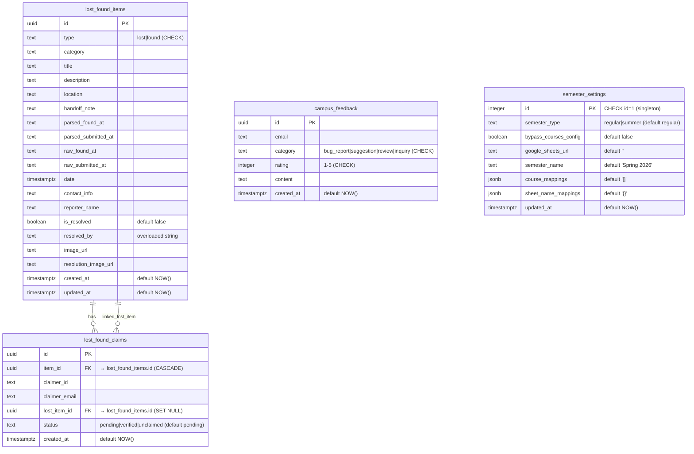

# 04 — Data Models & Schema

## 1. TypeScript Domain Types

Canonical source: `src/lib/types.ts:1-188`.

### 1.1 Exam Schedule Types

```ts
// src/lib/types.ts:1-12
interface ExamEntry {
  date: string;        // "DD/MM/YYYY" — e.g., "18/05/2026"
  day: string;         // "Monday"
  time: string;        // "09:00 AM – 11:00 AM" (regular) or "9:00 AM to 12:00 PM" (summer)
  courseCode: string;  // "CS1004"
  courseName: string;
  batch: string;       // "2023" or literal "Summer"
  department: string;  // "CS" or "ALL" (summer)
  school: string;      // "FSC", "FSM", or "FSE"
  room?: string;       // summer only — comma-separated (e.g., "C-301, C-302")
  sections?: string;   // summer only — raw (e.g., "A", "AB", "BAF-9A, 9B")
}

// src/lib/types.ts:14-20
const SCHOOLS = ['FSC', 'FSM', 'FSE'];
const SCHOOL_DEPARTMENTS: Record<string, string[]> = {
  FSC: ['CS', 'AI', 'DS', 'CY', 'SE'],
  FSM: ['BBA', 'AF', 'BA', 'FT'],
  FSE: ['EE', 'CE'],
};

// src/lib/types.ts:22-27
interface FilterState {
  batch: string;
  department: string;
  school: string;
  query: string;
}

// src/lib/types.ts:29-43
const DEPARTMENTS: string[] = ['CS','AI','DS','CY','SE','BBA','AF','BA','FT','EE','CE'];
const DEPARTMENT_LABELS: Record<string, string> = {
  CS: 'Computer Science', AI: 'Artificial Intelligence', DS: 'Data Science',
  CY: 'Cyber Security', SE: 'Software Engineering',
  BBA: 'Bachelor of Business Admin', AF: 'Accounting and Finance',
  BA: 'Business Analytics', FT: 'FinTech',
  EE: 'Electrical Engineering', CE: 'Computer Engineering',
};

function getAvailableBatches(entries: ExamEntry[]): string[] {
  return [...new Set(entries.map(e => e.batch))].sort().reverse();
}
```

### 1.2 Weekly Timetable Types

```ts
// src/lib/types.ts:57-73
interface TimetableEntry {
  courseName: string;
  batch: string;
  department: string;
  section: string;             // "A", "BX", "A1"
  day: string;                 // "Monday"
  time: string;                // "08:30 - 10:00" (24-h, FAST PM heuristic applies)
  room: string;                // "CR-01", "TBA"
  type: 'lecture' | 'lab';     // 'lab' if name ends with 'Lab'
  category: 'regular' | 'repeat';
  rescheduled?: boolean;
  exam?: boolean;              // flags "Mid"/"Exam"/"Sessional" slots
  isElective?: boolean;
  electiveGroup?: string | null;   // "G-I", "Gp-II"
  cancelled?: boolean;
  reserved?: boolean;
}

// src/lib/types.ts:75-87
const TIMETABLE_META_KEY = '__meta__';

interface TimetableSheetMeta {
  day: string;
  sheetName: string;
  date?: string;       // "03 Aug"
  isoDate?: string;    // "2026-08-03"
  isMakeup?: boolean;
}

interface TimetableMetadata {
  days: TimetableSheetMeta[];
}

// src/lib/types.ts:89-115 — nested map types
type TimetableSlot = {
  room: string;
  time: string;
  rescheduled?: boolean;
  exam?: boolean;
  isElective?: boolean;
  elective_group?: string | null;   // ⚠️ snake_case here (camelCase in TimetableEntry)
  cancelled?: boolean;
  reserved?: boolean;
};

type TimetableDayMap        = Record<string, TimetableSlot[]>;
type TimetableSectionMap    = Record<string, TimetableDayMap>;
type TimetableCourseMap     = Record<string, TimetableSectionMap>;
interface TimetableDepartmentMap {
  regular: TimetableCourseMap;
  repeat: TimetableCourseMap;
}
type TimetableBatchMap      = Record<string, TimetableDepartmentMap>;

const DAYS_ORDER = ['Monday','Tuesday','Wednesday','Thursday','Friday','Saturday']; // no Sunday
const TIMETABLE_SECTIONS = ['A', 'B', 'C', 'BX'];

// src/lib/types.ts:122-129 — raw JSON shape from Python scraper
// batch → dept → ("regular"|"repeat") → courseName → section → day → [{room,time}]
type RawTimetableJSON = Record<string, TimetableBatchMap> & {
  [TIMETABLE_META_KEY]?: TimetableMetadata;
};
```

⚠️ **Type inconsistency**: `TimetableSlot.elective_group` uses snake_case (matches Python output), but `TimetableEntry.electiveGroup` uses camelCase. `flattenTimetable` (`src/lib/timetable-filter.ts:53`) bridges this with `(slot as any).is_elective ?? false` — bypassing type system.

### 1.3 Summer Course Catalog Types

```ts
// src/lib/types.ts:137-143
interface SummerCourseCatalogEntry {
  sheetName: string;          // exact courseName as it appears in Google Sheet
  displayName: string | null; // admin alias (null = show sheetName as-is)
  hidden: boolean;            // exclude from student checklist if true
  examOnly?: boolean;         // true = course in exam schedule but not weekly timetable (FSM/FSE)
  school?: 'FSC' | 'FSM' | 'FSE';
}

// src/lib/types.ts:146-149
interface TimetableAPIResponse {
  entries: TimetableEntry[];
  catalog: SummerCourseCatalogEntry[];
}

// src/lib/types.ts:151-188
type RegularCourseMappings = Record<string, Record<string, string[]>>;
// e.g., { "2024": { "CS": ["DB", "OS", "Prob & Stats", ...] } }

const HARDCODED_VALID_COURSES_MAP: RegularCourseMappings = {
  "2022": { /* 5 depts */ },
  "2023": { /* 5 depts */ },
  "2024": { /* 5 depts */ },
  "2025": { /* 5 depts */ }
};
// Note: duplicate "Blockchain" entry in CY/2022 (line 165) — copy-paste error
```

### 1.4 Faculty Types

```ts
// src/lib/faculty.ts:7-19
interface FacultyMember {
  name: string;
  status: string;            // "Professor", "HoD (X) & Associate Professor", etc.
  email: string;
  office_room: string | null;
  linkedin_profile: string | null;
  profile_url: string;       // https://isb.nu.edu.pk/Profile.php?id=N
  image_url: string;         // https://isb.nu.edu.pk/assets/img/person/N_.webp
}

interface RawFacultyDepartment {
  department: string;        // full group name e.g. "Department of Accounting and Finance"
  faculty: FacultyMember[];
}

type DeptFileKey = 'AIDS' | 'AF' | 'CE' | 'CS' | 'CY' | 'EE' | 'MS' | 'SE' | 'SH';
```

### 1.5 Events Types

```ts
// src/lib/events.ts:8-19
interface StudentEvent {
  id?: string;
  event_name: string;
  date: string;              // "August 4" or "Jan 15"
  time: string;              // "9:00 am - 4:00 pm" or "All day"
  event_location: string;
  from?: string;
}

interface CalendarEvent extends StudentEvent {
  day: number;
  month: number;
  year: number;
}

interface CalendarCell {
  day: number;
  month: number;
  year: number;
  inCurrentMonth: boolean;
}
```

### 1.6 Lost & Found Types

```ts
// ⚠️ LostFoundItem type is defined INSIDE src/app/lost-found/page.tsx (not in lib/types)
// Inferred from API responses (MappedItem shape):
interface LostFoundItem {
  id: string;                // UUID
  type: 'lost' | 'found';
  category: 'Electronics' | 'Documents' | 'Accessories' | 'Clothing' |
            'Keys' | 'Bags' | 'Books' | 'Other';
  title: string;
  description: string;
  location: string;
  handoffNote: string | null;
  parsedFoundAt?: string | null;
  parsedSubmittedAt?: string | null;
  rawFoundAt?: string | null;
  rawSubmittedAt?: string | null;
  date: string;              // ISO 8601 timestamp
  contactInfo: string;       // ⚠️ force-lowercased on insert (corrupts phone numbers)
  reporterName: string | null;
  isResolved: boolean;
  resolvedBy: string | null; // ⚠️ overloaded: 'admin' | 'claimerId:lostItemId' | 'Claimant verified (email)' | 'ammarasad321993'
  imageUrl: string | null;
  resolutionImageUrl: string | null;
  createdAt: string;
  updatedAt: string;
}

// Inferred from API responses (Claim shape):
interface LostFoundClaim {
  id: string;
  itemId: string;            // references lost_found_items.id (the found item)
  claimerId: string;         // persistent user ID from localStorage 'lf-user-id'
  claimerEmail: string;
  lostItemId: string | null; // optional reference to a lost item
  status: 'pending' | 'verified' | 'unclaimed';
  createdAt: string;
}
```

### 1.7 Admin / Auth Types

```ts
// src/lib/admin.ts (no exported types — functions only)
// Cookie shape: admin_session = base64(`${ADMIN_USERNAME}:${ADMIN_PASSWORD}`)
// e.g., "YWRtaW46cGFzc3dvcmQ=" for "admin:password"

// src/lib/timetable-live.ts:7-16
interface UserConfig {
  batch: string;
  school: string;
  dept: string;
  section: string;
}

interface TimetableResultPreference {
  sectionByCourse: Record<string, string>;   // courseKey → section
  removedCourseKeys: string[];
}

const RESULT_PREFS_STORAGE_KEY = 'fsc_timetable_results_preferences_v1';
```

---

## 2. Supabase Database Schema

Canonical source: `supabase_schema.sql:1-153`.

### 2.1 ER Diagram (Mermaid)



### 2.2 Table Definitions

#### `lost_found_items` (Supabase table)
| Column | Type | Constraints | Notes |
|--------|------|-------------|-------|
| `id` | UUID | PK, default `gen_random_uuid()` | |
| `type` | TEXT | NOT NULL, CHECK IN ('lost','found') | |
| `category` | TEXT | NOT NULL | One of 8 categories (Electronics/Documents/Accessories/Clothing/Keys/Bags/Books/Other) |
| `title` | TEXT | NOT NULL | ≥3 chars (enforced in API, not DB) |
| `description` | TEXT | NOT NULL | ≥5 chars (enforced in API) |
| `location` | TEXT | NOT NULL | ≥2 chars (enforced in API) |
| `handoff_note` | TEXT | nullable | |
| `parsed_found_at` | TEXT | nullable | LLM-normalized "where found" |
| `parsed_submitted_at` | TEXT | nullable | LLM-normalized "handed off to" |
| `raw_found_at` | TEXT | nullable | Original user input |
| `raw_submitted_at` | TEXT | nullable | Original user input |
| `date` | TIMESTAMPTZ | NOT NULL | |
| `contact_info` | TEXT | NOT NULL | ⚠️ Force-lowercased by API (corrupts phone numbers) |
| `reporter_name` | TEXT | nullable | |
| `is_resolved` | BOOLEAN | default false | |
| `resolved_by` | TEXT | nullable | ⚠️ Overloaded: `'admin'` / `'Claimant verified (email)'` / `'claimerId:lostItemId'` / `'ammarasad321993'` |
| `image_url` | TEXT | nullable | Public Supabase Storage URL |
| `resolution_image_url` | TEXT | nullable | Public Supabase Storage URL |
| `created_at` | TIMESTAMPTZ | default NOW() | |
| `updated_at` | TIMESTAMPTZ | default NOW() | |

Indexes: `idx_lost_found_items_is_resolved` on `is_resolved`.

#### `lost_found_claims` (Supabase table)
| Column | Type | Constraints |
|--------|------|-------------|
| `id` | UUID | PK, default `gen_random_uuid()` |
| `item_id` | UUID | FK → `lost_found_items.id` ON DELETE CASCADE |
| `claimer_id` | TEXT | NOT NULL (persistent user ID from localStorage) |
| `claimer_email` | TEXT | NOT NULL |
| `lost_item_id` | UUID | FK → `lost_found_items.id` ON DELETE SET NULL |
| `status` | TEXT | default 'pending', CHECK IN ('pending','verified','unclaimed') |
| `created_at` | TIMESTAMPTZ | default NOW() |

#### `campus_feedback`
| Column | Type | Constraints |
|--------|------|-------------|
| `id` | UUID | PK |
| `email` | TEXT | nullable |
| `category` | TEXT | NOT NULL, CHECK IN ('bug_report','suggestion','review','inquiry') |
| `rating` | INTEGER | NOT NULL, CHECK 1-5 |
| `content` | TEXT | NOT NULL |
| `created_at` | TIMESTAMPTZ | default NOW() |

#### `semester_settings` (singleton — `id=1` only)
| Column | Type | Default |
|--------|------|---------|
| `id` | INTEGER | 1 (CHECK `id = 1`) |
| `semester_type` | TEXT | 'regular' (CHECK 'regular'/'summer') |
| `bypass_courses_config` | BOOLEAN | false |
| `google_sheets_url` | TEXT | '' |
| `semester_name` | TEXT | 'Spring 2026' |
| `course_mappings` | JSONB | '[]' — SummerCourseCatalogEntry[] |
| `sheet_name_mappings` | JSONB | '{}' — weekday→sheet name |
| `updated_at` | TIMESTAMPTZ | NOW() |

Seed: `INSERT INTO semester_settings (id, semester_type, ...) VALUES (1, 'regular', false, '', 'Spring 2026', '[]', '{}') ON CONFLICT (id) DO NOTHING;`

### 2.3 Storage Bucket

- **Bucket name:** `lost_found_images` (public)
- **Policies:** Public SELECT (anyone can read), Public INSERT (anyone can upload — used by anonymous users submitting lost/found reports)
- **Used by:**
  - `src/app/lost-found/page.tsx` (4 upload sites: ReportForm original image, VerifyHoldDialog resolution image, ItemDetail.handleVerifyAndResolve resolution image, plus corresponding `getPublicUrl` calls)
- **File naming:** Supabase auto-generates UUID-based filenames; client prepends a folder prefix (e.g., `claims/${claimId}/...`)

### 2.4 Row-Level Security (RLS)

All 4 tables have RLS enabled. **All policies are permissive** — the anon key can perform all CRUD on all tables:

```sql
-- lost_found_items: public SELECT, INSERT, UPDATE, DELETE (all true)
-- lost_found_claims: public SELECT, INSERT, DELETE (no UPDATE policy!)
-- campus_feedback: public SELECT, INSERT, DELETE (no UPDATE policy)
-- semester_settings: public SELECT, UPDATE (no INSERT or DELETE policy)
```

⚠️ **Critical**: `lost_found_claims` has no UPDATE policy. This means the server (using anon key) CANNOT update claim status from `'pending'` to `'verified'`. The codebase acknowledges this in inline comments:
- `src/app/api/lost-found/[id]/route.ts:285` — "Try to update claim status to verified for good measure (might be blocked by RLS, which is fine since we now bypass it)"
- `src/app/api/lost-found/verify/route.ts:157` — "Try to update claim status for good measure (fails silently due to RLS but okay)"

The `verify-hold` route appears to actually succeed in updating claims — likely because Supabase's RLS for UPDATE was added later or the comment is stale. Behavior should be re-verified in production.

---

## 3. JSON File Schemas (Build-Time Data)

All under `public/data/`. Updates require Vercel rebuild (auto-triggered by GitHub Actions commits).

### 3.1 `timetable.json` (53k)

Top-level shape:

```ts
{
  "Summer": {                                    // batch key (could be "2024", "2025", etc.)
    "CS": {                                      // dept key
      "regular": {                               // category
        "AP": {                                  // course name
          "B": {                                 // section
            "Monday": [{ "room": "D-304", "time": "08:30-10:15" }]
          }
        }
      },
      "repeat": { /* same shape */ }
    }
  },
  "System": { /* unused by flattenTimetable — skipped */ },
  "__meta__": {
    "days": [
      { "day": "Monday", "sheetName": "Monday", "date": "03 Aug",
        "isoDate": "2026-08-03", "isMakeup": false },
      { "day": "Tuesday", "sheetName": "Tuesday (05 Aug)", "date": "05 Aug",
        "isoDate": "2026-08-05", "isMakeup": true }
    ]
  }
}
```

**Note**: Only top-level keys `Summer` (current batch) and `__meta__` exist in current deployment. Other batches ("2024", "2025", etc.) are NOT in the live `timetable.json` — they would need to be regenerated by `all_courses_schedule.py` for regular semester mode.

Sheet name patterns parsed by `timetable/page.tsx:resolvedData` memo and `DesktopTicker.tsx`:
- `"Monday"` — undated (current week)
- `"Monday (03 Aug)"` — dated makeup day (regex `/\(([^)]+)\)/`)

### 3.2 `regular_schedule.json` (87k, 381 entries)

Array of `ExamEntry` objects (regular-semester exams). Sample:

```json
[
  {
    "date": "18/05/2026", "day": "Monday",
    "time": "9:00 to 12:00 PM",
    "courseCode": "CS2005", "courseName": "Database Systems",
    "batch": "2024", "department": "CS", "school": "FSC"
  }
]
```

### 3.3 `summer_schedule.json` (7k, 26 entries)

Array of `ExamEntry` objects (summer-semester exams). Includes FSM/FSE courses:

```json
[
  {
    "date": "10/08/2026", "day": "Monday",
    "time": "9:00 AM to 12:00 PM",
    "courseCode": "MT1003", "courseName": "Calculus and Analytical Geometry",
    "batch": "Summer", "department": "ALL", "school": "FSC",
    "room": "C-301", "sections": ""
  }
]
```

Schools present: `['FSC', 'FSM', 'FSE']`. Used by `src/lib/exam-catalog.ts:29` to merge FSM/FSE exam-only courses into the summer catalog.

### 3.4 `semester_calendar.json` (2k)

```ts
{
  semester: "Summer 2026",
  academicYear: "2025-2026",
  generatedAt: "2026-06-17",
  weekCount: 8,
  totalCreditHoursPerWeek: 16,
  keyDates: [
    { label: "First day of classes", date: "2026-06-15", type: "academic", icon: "school" },
    // 8 entries total: classes start, sessionals, finals, etc.
  ],
  holidays: [
    { label: "Independence Day", date: "2026-08-14", type: "national" }
  ],
  academicRanges: [
    { label: "Regular Classes", startDate: "2026-06-15", endDate: "2026-08-07",
      color: "blue", type: "classes" }
    // 3 ranges: classes, sessionals, finals
  ]
}
```

### 3.5 `student_events.json` (5k, 31 events)

```ts
{
  filtered_at: "2026-08-03T09:56:33.859456",
  date_range: "2026-08-01 to 2026-09-30",
  total_original: number,
  total_filtered: number,
  events: [
    {
      event_name: "Workshop S&H",
      date: "August 4",                    // "Month day" format
      time: "9:00 am - 4:00 pm",           // free-text time
      event_location: "C-109 by Ms. Kanwal",
      from?: string
    }
  ]
}
```

### 3.6 `slate_calendar_events.json` (10k)

Raw scraped events from FAST Slate portal. Used as INPUT to `filter_events.py` which produces `student_events.json`. Not directly consumed by frontend.

```ts
{
  scraped_at: string,
  date_range: string,
  total_events: number,
  events: Array<{ /* raw Slate event shape — varies */ }>
}
```

### 3.7 `faculty/` directory (10 files)

- `faculty_data.json` — combined array of `RawFacultyDepartment` (9 departments)
- Per-department files: `AF.json`, `AIDS.json`, `CE.json`, `CS.json`, `CY.json`, `EE.json`, `MS.json`, `SE.json`, `SH.json` (each is a `RawFacultyDepartment`)

Sample `faculty_data.json` entry:

```json
[
  {
    "department": "Department of Accounting and Finance",
    "faculty": [
      {
        "linkedin_profile": null,
        "profile_url": "https://isb.nu.edu.pk/Profile.php?id=9133",
        "image_url": "https://isb.nu.edu.pk/assets/img/person/9133_.webp",
        "name": "Dr. Falak Khan",
        "email": "falak.khan@nu.edu.pk",
        "status": "Assistant Professor",
        "office_room": null
      }
    ]
  }
]
```

---

## 4. localStorage Schema

### 4.1 General App Keys (`fsc_*`)

| Key | Shape | Set by | Read by | Purpose |
|-----|-------|--------|---------|---------|
| `fsc_user_config` | `UserConfig` (`{batch, school, dept, section}`) | `/home` page `savePreferences()` | `/`, `/home`, `DesktopTicker`, `timetable/custom` (exclusivity check) | Saved user's default batch/dept/section |
| `fsc_active_semester` | `'regular' \| 'summer'` | `/`, `/home`, `/timetable`, `/timetable/custom`, `/rooms`, `/custom`, `/lost-found` (Footer) | All same pages on mount | Cache of Supabase `semester_settings.semester_type` to avoid roundtrip |
| `fsc_semester_name` | `string` (e.g., `"Summer 2026"`) | Same as above | `/`, `/home`, `/timetable`, `/timetable/custom`, `/rooms`, `/custom`, `ExportButton` | Cache of `semester_settings.semester_name` for display |
| `fsc_summer_courses` | `Record<sheetName, section>` | `/home` (summer mode), `/timetable` (remove/update), `/timetable/custom` (read in summer) | `/schedule?batch=Summer`, `/timetable` | Selected summer courses + section per course |
| `fsc_custom_bundles` | `Bundle[]` (`{id, name, rows}`) | `/timetable/custom` (auto-persists via useEffect) | `/`, `/home` (exclusivity check), `/timetable/custom` | User's saved custom timetable bundles |
| `fsc_custom_exam_bundles` | `Bundle[]` | `/custom` (auto-persists) | `/custom` | User's saved custom exam bundles (separate from timetable bundles) |
| `fsc_timetable_preview` | `Array<CourseRow>` | `/timetable/optimizer` `handlePreview()` | `/timetable/custom` (one-shot read on mount, then removed) | Handoff from optimizer → custom timetable builder |
| `fsc_timetable_results_preferences_v1` | `Record<"${batch}\|${dept}", TimetableResultPreference>` | `/timetable` `persistResultPreferences()` | `/timetable`, `DesktopTicker` | Per-batch/dept section overrides + removed courses |
| `fsc-theme` | `'light' \| 'dark'` | `lib/theme.tsx` `toggleTheme()` | `lib/theme.tsx` on mount | User's explicit theme choice |

### 4.2 Lost & Found Keys (`lf-*`)

15 keys, all managed by helper functions in `src/app/lost-found/page.tsx:306-625`.

| Key | Shape | Purpose |
|-----|-------|---------|
| `lf-user-id` | `string` (random ID) | Persistent user identifier used as `claimerId` |
| `lf-my-reports` | `string[]` (item UUIDs) | Items this user has reported |
| `lf-recently-viewed` | `string[]` (item UUIDs, capped 20) | Recently viewed items carousel |
| `lf-bookmarks` | `string[]` (item UUIDs) | Saved/bookmarked items |
| `lf-last-visit` | `string` (epoch millis) | Last visit timestamp — used to compute "new since visit" notifications |
| `lf-view-counts` | `Record<itemId, number>` | Per-item view count — grows unbounded |
| `lf-urgent-items` | `string[]` (item UUIDs) | Items user marked as urgent |
| `lf-feedback` | `Record<itemId, string>` | Per-item private feedback notes |
| `lf-onboarded` | `'true'` | Whether user has seen the 3-tip onboarding carousel |
| `lf-item-claims-${itemId}` | `Array<{ claimerId, claimerEmail, lostItemId? }>` | Per-item local claim cache (grows unbounded) |
| `lf-item-comments-${itemId}` | `Array<{ id, author, text, createdAt }>` | Per-item local comment thread (grows unbounded) |
| `lf-activity-feed` | `Array<{ type, itemId, title, timestamp }>` (capped 20) | Activity feed entries |
| `lf-notifications` | `Array<{...}>` (capped 30) | Generated notifications |
| `lf-pending-urgent` | (legacy / unclear usage) | [INFERRED] Possibly staging for urgent items pending server confirmation |
| `lf-claimer-email` | `string` | User's preferred email for claims (cached to avoid re-entry) |

### 4.3 Cleanup Concerns

- `lf-view-counts` and `lf-item-claims-${itemId}` grow unbounded as user browses more items.
- No `localStorage.removeItem` calls except for `fsc_timetable_preview` (one-shot handoff) and theme toggle.
- No versioning — schema changes would silently break old payloads.

---

## 5. Environment Variable Matrix

| Env Var | Required? | Set In | Used By | Notes |
|---------|-----------|--------|---------|-------|
| `NEXT_PUBLIC_SUPABASE_URL` | ✅ Yes | Vercel + GitHub Actions | `src/lib/supabase.ts`, Python scrapers | `NEXT_PUBLIC_*` → baked into client bundle |
| `NEXT_PUBLIC_SUPABASE_ANON_KEY` | ✅ Yes | Vercel + GitHub Actions | `src/lib/supabase.ts`, Python scrapers | Public anon key — RLS only |
| `ADMIN_USERNAME` | ✅ Yes | Vercel | `src/lib/admin.ts` | Plain string |
| `ADMIN_PASSWORD` | ✅ Yes | Vercel | `src/lib/admin.ts` | Plain string (no hashing) |
| `GITHUB_TOKEN` | ⚠️ Optional | Vercel | 4 API routes | If missing, AI features degrade to local fallback (except `claim/sync` which hard-fails) |
| `GMAIL_USER` | ⚠️ Optional | Vercel | `src/lib/email.ts` | If missing, all email functions silently no-op |
| `GMAIL_APP_PASSWORD` | ⚠️ Optional | Vercel | `src/lib/email.ts` | Same as above |
| `CRON_SECRET` | ⚠️ Optional (prod only) | Vercel | `api/lost-found/cron/reminders` | Only checked when `NODE_ENV === 'production'` |
| `GOOGLE_SHEETS_API_KEY` | ⚠️ Optional | GitHub Actions | Python scrapers | For Google Sheets CSV fetch |
| `GROQ_API_KEY` | ⚠️ Optional | GitHub Actions | Python scrapers | For LLM-based data cleanup |
| `SLATE_USERNAME` | ⚠️ Optional | GitHub Actions | `scrape_slate.py` | FAST Slate auth |
| `SLATE_PASSWORD` | ⚠️ Optional | GitHub Actions | `scrape_slate.py` | FAST Slate auth |
| `SLATE_TOOL_BASE` | ⚠️ Optional | GitHub Actions | `scrape_slate.py` | Default: `https://slate.nu.edu.pk/...` |
| `MAIN_PUSH_TOKEN` | ✅ Yes (CI) | GitHub Actions | Workflow `checkout@v4` | PAT for git push to main |
| `DATABASE_URL` / `POSTGRES_URL` / `POSTGRES_PRISMA_URL` | local only | local `.env` | `scripts/setup-settings-db.ts` | Direct Postgres for one-off DB setup |
| `NODE_ENV` | auto | Vercel/Next.js | `api/admin/login`, `api/admin/logout`, `api/lost-found/cron/reminders` | Controls cookie `secure` flag + cron auth bypass |
