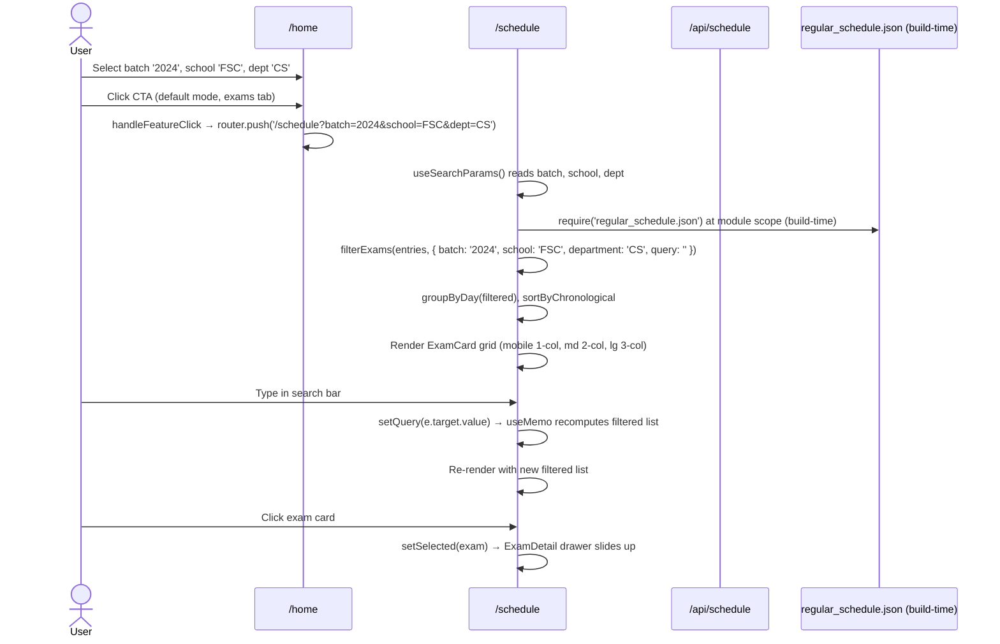
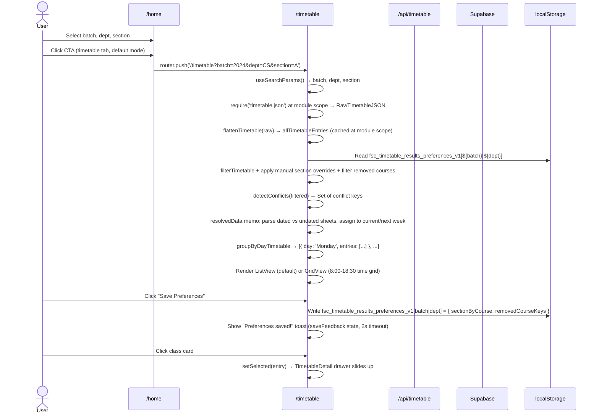
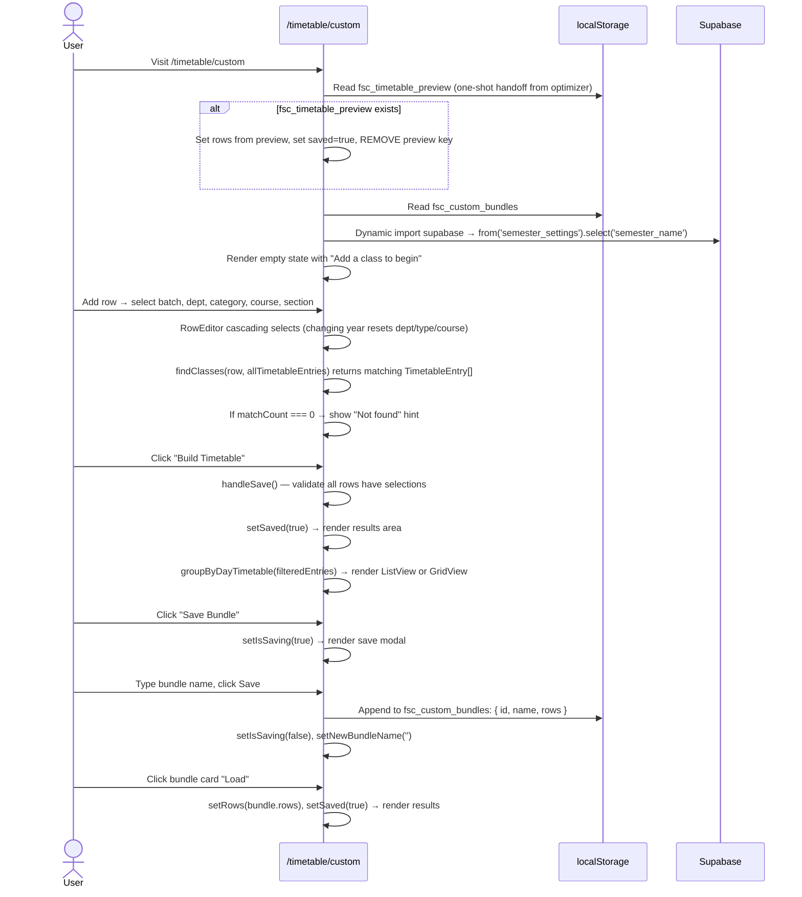
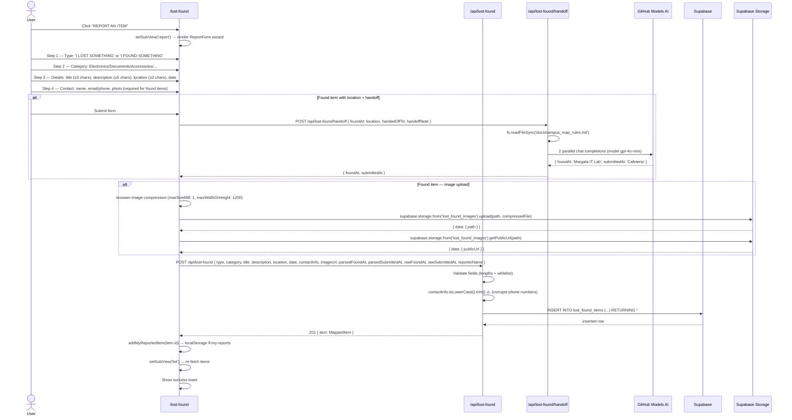
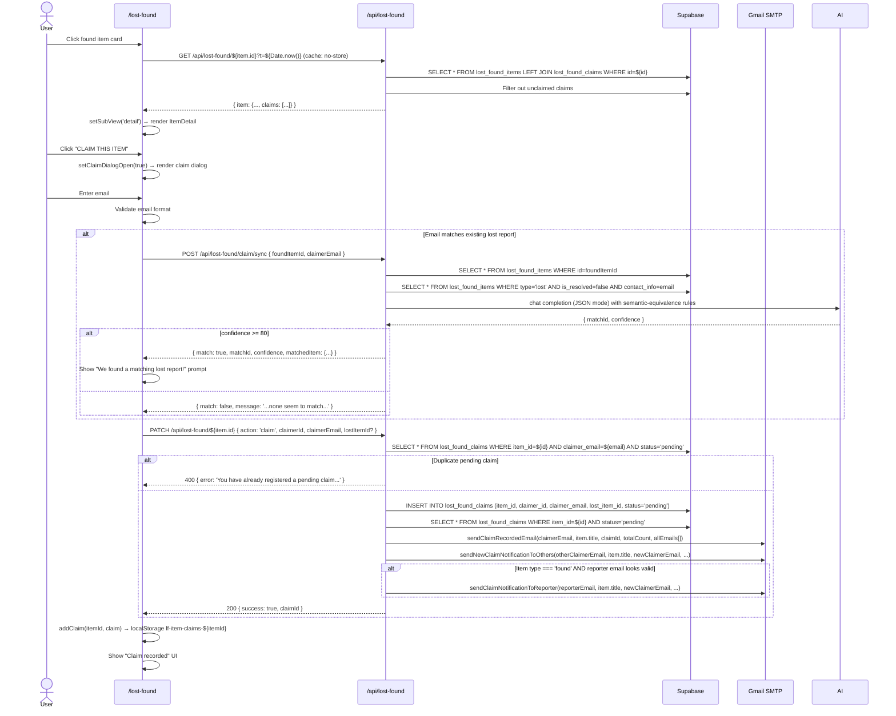
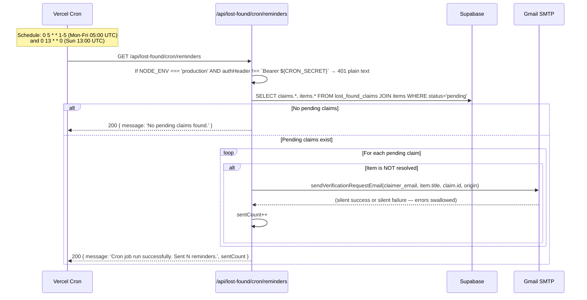

# 05 — Data Flow & Sequence Diagrams

This file traces the full pathway for each core user journey: UI event → client handler → state update → API call → server handler → DB query → response → state update → UI re-render. For each journey, both a Mermaid `sequenceDiagram` AND a plain-ASCII trace are provided.

## Journey Index

| # | Journey | Page | Primary API calls |
|---|---------|------|-------------------|
| 1 | Landing → feature navigation | `/` | `GET /api/timetable` (summer mode pre-warm) + Supabase `semester_settings` |
| 2 | Configure & view exam schedule (regular semester) | `/home` → `/schedule` | `GET /api/schedule?batch&dept` |
| 3 | Configure & view summer exam schedule | `/home` → `/schedule?batch=Summer` | `GET /api/timetable` (for catalog) |
| 4 | Configure & view weekly timetable | `/home` → `/timetable` | `GET /api/timetable` |
| 5 | Build custom timetable bundle | `/timetable/custom` | Supabase `semester_settings` only |
| 6 | Run timetable optimizer | `/timetable/optimizer` | `GET /api/timetable` (summer), no API in regular mode |
| 7 | Find free rooms | `/rooms` | none (build-time JSON) |
| 8 | View faculty directory | `/faculty` | none (build-time JSON) |
| 9 | View campus events | `/events` | none (build-time JSON) |
| 10 | Report a lost/found item | `/lost-found` (subView=report) | `POST /api/lost-found/handoff` + Supabase Storage upload + `POST /api/lost-found` |
| 11 | Claim a found item | `/lost-found` (subView=detail) | `POST /api/lost-found/claim/sync` + `PATCH /api/lost-found/[id]` |
| 12 | AI-verify possession & resolve | `/lost-found` (VerifyHoldDialog) | `POST /api/lost-found/verify` + Supabase Storage upload + `POST /api/lost-found/claim/verify-hold` |
| 13 | Admin login | `/admin` | `POST /api/admin/login` |
| 14 | Admin refetch timetable | `/admin` (settings tab) | `POST /api/admin/refetch-timetable` → GitHub Actions dispatch |
| 15 | Admin toggles item resolved | `/admin` (items tab) | `PATCH /api/lost-found/[id]` action='admin-toggle-resolved' |
| 16 | Cron reminders | (Vercel Cron) | `GET /api/lost-found/cron/reminders` → Gmail SMTP |

---

## Journey 1 — Landing → Feature Navigation

### Mermaid

```mermaid
sequenceDiagram
  actor U as User
  participant R as React (/)
  participant LS as localStorage
  participant API as /api/timetable
  participant SB as Supabase (anon)
  participant Rtr as useRouter

  U->>R: Visit /
  R->>LS: Read fsc_user_config, fsc_custom_bundles, fsc_semester_name, fsc_active_semester
  alt fsc_active_semester === 'summer'
    R->>API: GET /api/timetable (cache: no-store)
    API->>SB: SELECT * FROM semester_settings WHERE id=1
    SB-->>API: { semester_type: 'summer', course_mappings, ... }
    API->>API: flattenTimetable(local timetable.json), mergeExamOnlyCourses(catalog)
    API-->>R: { entries: 52, catalog: 25 }
    R->>R: setSummerCoursesList, setSummerCatalog
  end
  R->>SB: Dynamic import('@/lib/supabase').from('semester_settings').select('*').eq('id',1).single()
  SB-->>R: settings row
  R->>LS: Write fsc_active_semester, fsc_semester_name
  R->>R: setIsSummerMode(true)
  R->>R: Render 8 feature cards (mobile 2-col, desktop 3-col)
  R->>R: Mount DesktopTicker (live clock + next class)

  U->>R: Click feature card (e.g., 'timetable')
  R->>R: handleFeatureClick('timetable', false)
  alt id === 'semester' → router.push('/semester')
  alt id === 'events' → router.push('/events')
  alt id === 'optimizer' → router.push('/timetable/optimizer')
  alt id === 'lost-found' → router.push('/lost-found')
  else → router.push('/home?feature=${id}')
  end
  Rtr-->>U: Navigate to /home?feature=timetable
```

### ASCII Trace

```
[User visits /]
   -> React (src/app/page.tsx:175): useEffect on mount
   -> Client: reads localStorage keys fsc_user_config, fsc_custom_bundles,
              fsc_semester_name, fsc_active_semester
   -> Client: if fsc_active_semester === 'summer':
        fetch GET /api/timetable (cache: 'no-store')
        -> Server (src/app/api/timetable/route.ts:316):
             -> Supabase: SELECT * FROM semester_settings WHERE id=1
             -> If settings.semester_type === 'summer':
                  - Read local public/data/timetable.json (via require)
                  - flattenTimetable(raw) → TimetableEntry[]
                  - Filter entries to batch === 'Summer'
                  - Apply course_mappings whitelist from settings
                  - mergeExamOnlyCourses(catalog) → adds FSM/FSE exam-only entries
                  - Return { entries, catalog }
        -> Client: setSummerCoursesList(data.entries), setSummerCatalog(data.catalog)
        -> Client: reads localStorage fsc_summer_courses → setSummerSelections()
   -> Client: checkSemesterType() — async function (src/app/page.tsx:200)
        -> Dynamic import('@/lib/supabase')
        -> Supabase: from('semester_settings').select('*').eq('id',1).single()
        -> If data.semester_type === 'summer': setIsSummerMode(true)
        -> Write back to localStorage: fsc_active_semester, fsc_semester_name
   -> Client: Typing animation (desktop only): setInterval(20ms) updates displayText
   -> Client: DesktopTicker mounts — reads fsc_timetable_results_preferences_v1
              from localStorage, computes ongoing/next class from summerCoursesList
   -> UI: Renders 8 feature cards (mobile 2-col grid; desktop 3-col grid with
          dot-grid texture + ambient blur glows)

[User clicks 'timetable' feature card]
   -> Client: handleFeatureClick('timetable', false) [src/app/page.tsx:255]
   -> Client: router.push('/home?feature=timetable')
   -> UI: Next.js client-side navigation to /home
```

### Caching Strategy

- `/api/timetable` is `force-dynamic` — no HTTP caching. Each navigation to `/` (in summer mode) triggers a fresh fetch.
- The Supabase `semester_settings` query is fired **twice** on landing in summer mode: once by `checkSemesterType()` and once by `/api/timetable` (server-side). [INFERRED — see verification log]
- localStorage caches `fsc_active_semester` to short-circuit the Supabase call, but the code re-fetches anyway to handle admin changes.

---

## Journey 2 — Configure & View Exam Schedule (Regular Semester)

### Mermaid



### ASCII Trace

```
[User on /home, exams tab, default mode]
   -> User selects: batch=2024, school=FSC, dept=CS
   -> User clicks CTA button
   -> Client (src/app/home/page.tsx): handleSubmit()
   -> Client: router.push('/schedule?batch=2024&school=FSC&dept=CS')

[User on /schedule?batch=2024&school=FSC&dept=CS]
   -> Page mount (src/app/schedule/page.tsx)
   -> Client: useSearchParams() → { batch: '2024', school: 'FSC', dept: 'CS' }
   -> Client: require('regular_schedule.json') at module scope → 381 ExamEntry[]
   -> Client (useEffect): reads localStorage fsc_active_semester → if 'summer',
                          setIsSummer(true). (For this journey, assume 'regular'.)
   -> Client (useMemo): filterExams(entries, { batch, school, department: dept, query: '' })
   -> Client: groupByDay(filtered) → [{ label: 'MON 18 MAY', entries: [...] }, ...]
   -> Client: sortByChronological (within each day)
   -> UI: Render ExamCard grid (mobile 1-col, md:grid-cols-2, lg:grid-cols-3)

[User types 'database' in search bar]
   -> Client: SearchBar onChange → setQuery('database')
   -> Client (useMemo): filtered = filterExams(...).filter(e =>
                          e.courseName.toLowerCase().includes('database') ||
                          e.courseCode.toLowerCase().includes('database'))
   -> UI: Re-render with filtered ExamCards

[User clicks exam card]
   -> Client: ExamCard onClick → setSelected(exam)
   -> UI: ExamDetail drawer slides up (mobile: 85dvh bottom sheet; desktop: right panel)
   -> Client (useMobileSwipe): attach touchstart/move/end listeners for swipe-to-close

[User clicks 'Add to calendar (.ics)']
   -> Client: ExamDetail button onClick → generateICS(exam)
   -> Client (src/lib/export.ts): build ICS string, Blob, <a download>, .click(), revoke URL
   -> UI: Browser downloads 'CS1004-exam.ics'

! Error path: filterExams returns empty array
   -> UI: EmptyState renders "No exams found for CS batch 2024..."
   -> UI: "Go back" button → window.history.back()
```

### Caching Strategy

- `regular_schedule.json` is bundled at build time (via `require()`). Updates require Vercel rebuild.
- HTTP cache: `Cache-Control: public, max-age=3600, stale-while-revalidate=86400` on `/data/regular_schedule.json` per `next.config.js:5-12` — but the page uses `require()` (bundled), not `fetch('/data/...')`, so this header is irrelevant for the page.
- No client-side caching of filtered results — re-computed every render via `useMemo`.

---

## Journey 3 — Configure & View Summer Exam Schedule

### Mermaid

```mermaid
sequenceDiagram
  actor U as User
  participant H as /home
  participant API as /api/timetable
  participant SB as Supabase
  participant S as /schedule

  U->>H: Switch to exams tab, summer mode auto-detected
  H->>API: GET /api/timetable (cached from / mount)
  API->>SB: SELECT semester_settings
  API-->>H: { entries: 52 summer TimetableEntry[], catalog: 25 SummerCourseCatalogEntry[] }
  H->>H: Render multi-school checklist (FSC | FSM | FSE columns)
  U->>H: Select courses: AP (section B), OOP (section A), Financial Accounting (FSM)
  H->>H: setSummerSelections({ AP: 'B', OOP: 'A', 'Financial Accounting': 'A' })
  H->>H: Write localStorage fsc_summer_courses
  U->>H: Click CTA
  H->>H: router.push('/schedule?batch=Summer')

  S->>S: useSearchParams() → { batch: 'Summer' }
  S->>S: require('summer_schedule.json') at module scope (26 ExamEntry[])
  S->>S: reads localStorage fsc_summer_courses → selectedCourses = ['AP','OOP','Financial Accounting']
  S->>S: filterSummerExams(entries, { query, selectedCourses })
  Note over S: matchesSummerCourse() 5-strategy matcher:
    1) SUMMER_COURSE_ALIASES map lookup
    2) exact match
    3) acronym match (effectively unreachable per audit)
    4) significant word overlap (≥3 char words)
    5) substring match (INTENTIONALLY REMOVED — prevents Lab variant leak)
  S->>S: groupByDay(filtered), sortByChronological
  S->>S: Render ExamCard grid with summer-specific Room + Sections fields
```

### ASCII Trace

```
[User on /home?feature=exams in summer mode]
   -> Page already fetched /api/timetable on mount → has catalog with school tags
   -> UI: Render summer checklist with 3 school tabs (FSC | FSM | FSE)
   -> UI: FSC column shows non-examOnly courses from catalog
   -> UI: FSM + FSE columns show examOnly courses (auto-added by mergeExamOnlyCourses)

[User selects AP section B in FSC column]
   -> Client: handleToggleSummerCourse('AP', 'B') [src/app/home/page.tsx]
   -> Client: setSummerSelections(prev => ({ ...prev, AP: 'B' }))
   -> Client: writeBack localStorage fsc_summer_courses

[User selects 'Financial Accounting' (examOnly) in FSM column]
   -> Client: setSummerSelections(prev => ({ ..., 'Financial Accounting': 'A' }))

[User clicks CTA]
   -> Client: handleSubmit() — isSummerMode + exams path
   -> Client: writeBack localStorage fsc_summer_courses (final)
   -> Client: router.push('/schedule?batch=Summer')

[User on /schedule?batch=Summer]
   -> Page mount (src/app/schedule/page.tsx)
   -> Client: useSearchParams() → { batch: 'Summer' }
   -> Client: setIsSummer(true) (also from localStorage fsc_active_semester === 'summer')
   -> Client: require('summer_schedule.json') at module scope → 26 ExamEntry[]
   -> Client (useEffect): reads localStorage fsc_summer_courses
   -> Client: selectedCourses = Object.keys(summerSelections) = ['AP', 'OOP', 'Financial Accounting']
   -> Client (useMemo): filterSummerExams(entries, { query: '', selectedCourses })
        -> For each entry, check if ANY selectedCourse matches via matchesSummerCourse()
        -> Strategy 1: SUMMER_COURSE_ALIASES['ap'] = ['applied physics'] — entry courseName 'Applied Physics' matches
        -> Strategy 2: 'Financial Accounting' === 'Financial Accounting' (exact match)
        -> Strategy 4: word overlap for 'oop' ↔ 'Object Oriented Programming'
   -> Client: groupByDay, sortByChronological
   -> UI: Render ExamCards with summer-specific "Room: C-301" and "Sections: BAF-9A, 9B" fields

! Error path: no summer courses selected
   -> Client: filterSummerExams returns [] (selectedCourses is empty array → no matches)
   -> UI: EmptyState renders
```

---

## Journey 4 — Configure & View Weekly Timetable

### Mermaid



### ASCII Trace

```
[User on /home?feature=timetable, default mode]
   -> User selects: batch=2024, dept=CS, section=A
   -> User clicks CTA
   -> Client (src/app/home/page.tsx): handleSubmit()
   -> Client: router.push('/timetable?batch=2024&dept=CS&section=A')

[User on /timetable?batch=2024&dept=CS&section=A]
   -> Page mount (src/app/timetable/page.tsx)
   -> Client: useSearchParams() → { batch: '2024', dept: 'CS', section: 'A' }
   -> Client: require('timetable.json') at module scope → RawTimetableJSON
   -> Client: flattenTimetable(raw) → allTimetableEntries (memoized)
   -> Client (useEffect on mount):
        - Dynamic import('@/lib/supabase')
        - Supabase: from('semester_settings').select('semester_name').eq('id',1).single()
        - Write localStorage fsc_semester_name
   -> Client (useEffect, summer mode only — skipped in this journey):
        - fetch GET /api/timetable (cache: 'no-store')

   -> Client (useMemo resolvedData): parse dated vs undated sheets
        - For each sheet name in raw.__meta__.days:
          - regex /\(([^)]+)\)/ → if match, it's a dated makeup day
          - Parse date "03 Aug" → isoDate "2026-08-03"
          - If isoDate < today OR > today+30days → skip
        - Separate dated (makeup) vs undated sheets
        - Assign undated sheets to current week
        - If current week has a dated makeup for that weekday → push undated to next week
        - Sort: today first, then chronological

   -> Client (useMemo filtered): filterTimetable + apply preferences
        - filterTimetable(allTimetableEntries, { batch, department: dept, section, query, includeRepeats })
        - Apply manual section overrides from preferences
        - Filter out removed courses
        - For batch 2025: normalizeSectionForBatch strips trailing digits

   -> Client (useMemo): detectConflicts(filtered, includeRepeats)
        - Group by day
        - For each pair on same day: skip if rescheduled/exam/Saturday
        - Check overlap via parseTimeRange
        - Returns Set of conflict keys

   -> UI: Render ListView (default) — TimetableCard per entry
        - Show conflict badge if entry key in conflict set
        - Show "📅 {Month} Makeup Days" button if any makeup sheets exist
        - Show "ELECTIVES / OTHERS" expansion panel for batch 2022 or other elective courses

[User toggles 'Grid' view]
   -> Client: setViewMode('grid')
   -> UI: Render GridView — 6-column day grid (Mon-Sat) × time rows (8:00-18:30)
        - 1.35px per minute, 56px time column
        - Each class rendered as absolutely-positioned block
        - Conflict z-index bumping

[User clicks class card]
   -> Client: TimetableCard onClick → setSelected(entry)
   -> UI: TimetableDetail drawer slides up (mobile 85dvh; desktop right panel)
   -> UI: Show 7-row detail grid (Day, Time, Room, Type, Section, Batch, Category)
   -> UI: If entry.cancelled → red "🚫 Canceled class" callout

[User clicks 'Change Section' dropdown on a card]
   -> Client: setIsSectionMenuOpen(true)
   -> Client: Render dropdown with available sections for this course
   -> User selects 'BX'
   -> Client: onChangeSection('BX') → updates manualSectionByCourse state
   -> Client: setResultPreferences memo recomputes
   -> UI: Re-render with new section's classes

[User clicks 'Remove ×' on a card]
   -> Client: onRemove() → adds entry key to removedCourseKeys state
   -> UI: Card disappears from list

[User clicks 'Save Preferences']
   -> Client: persistResultPreferences()
   -> Client: writeBack localStorage fsc_timetable_results_preferences_v1[batch|dept]
   -> Client: setSaveFeedback('Preferences saved!') (2s timeout to clear)

! Error path: no entries match the filter
   -> UI: EmptyState renders
   -> UI: "Go back" button → window.history.back()
```

---

## Journey 5 — Build Custom Timetable Bundle

### Mermaid



### ASCII Trace

```
[User visits /timetable/custom]
   -> Page mount (src/app/timetable/custom/page.tsx)
   -> Client: useEffect on mount
        - Read localStorage fsc_timetable_preview
        - If exists: setRows(previewRows), setSaved(true), localStorage.removeItem('fsc_timetable_preview')
        - Read localStorage fsc_custom_bundles → setBundles()
        - Dynamic import supabase → fetch semester_name → write localStorage fsc_semester_name
   -> UI: If no rows AND no saved state → empty state with "Add a class to begin"

[User clicks "Add a class"]
   -> Client: addRow() → setRows(prev => [...prev, { id: nextIdx++, batch: '', stream: '', category: '', selection: '', errors: {...} }])
   -> UI: RowEditor card renders with 4-5 cascading <select> dropdowns

[User selects batch '2024']
   -> Client: updateRowField(idx, 'batch', '2024')
   -> Client: Cascading reset — stream='', category='', selection='' (because options depend on batch)
   -> Client: setResultPreferences invalidation — setSaved stays true but results recompute

[User selects dept 'CS', category 'regular', course 'DB', section 'A']
   -> Client: For each select, findClasses(row, allTimetableEntries) returns matching TimetableEntry[]
   -> UI: If matchCount === 0 → show "Not found" hint under select
   -> UI: If matchCount > 0 → enable "Build Timetable" button

[User clicks "Build Timetable"]
   -> Client: handleSave() — validate all rows have selections
   -> Client: setSaved(true)
   -> UI: Render results area with search bar
   -> Client (useMemo filtered): for each row, filter allTimetableEntries by batch+dept+category+courseName+section
   -> Client: groupByDayTimetable(filtered)
   -> UI: Render ListView (default) or GridViewCustom

[User clicks "Save Bundle"]
   -> Client: setIsSaving(true)
   -> UI: Save Bundle modal opens with name input
[User types "My Semester Plan" and clicks Save]
   -> Client: handleCreateBundle()
   -> Client: Check exclusivity: localStorage fsc_user_config must NOT exist
     (else: setExclusivityError(modal) and abort)
   -> Client: setBundles(prev => [...prev, { id: Date.now().toString(), name: 'My Semester Plan', rows }])
   -> Client: useEffect on bundles change → auto-persist to localStorage fsc_custom_bundles
   -> Client: setIsSaving(false), setNewBundleName('')

[User clicks bundle card "Load"]
   -> Client: setActiveBundleId(bundle.id), setRows(bundle.rows), setSaved(true)
   -> UI: Re-render results area with loaded bundle's classes

[User clicks bundle card "Generate"]
   -> Client: setActiveBundleId(bundle.id), setRows(bundle.rows), setSaved(true)
   -> Same as Load — bundles don't have a separate "generate" action
```

### Exclusivity Rule

`/home` and `/timetable/custom` are mutually exclusive:
- `/home` `savePreferences()` refuses to save if `fsc_custom_bundles` already has entries (shows modal with ShieldAlert icon)
- `/timetable/custom` `handleCreateBundle()` refuses to save if `fsc_user_config` exists (shows same modal)

This prevents a user from having both a "default semester plan" and "custom bundles" active simultaneously.

---

## Journey 6 — Run Timetable Optimizer

### Mermaid

```mermaid
sequenceDiagram
  actor U as User
  participant O as /timetable/optimizer
  participant LS as localStorage
  participant API as /api/timetable

  U->>O: Visit /timetable/optimizer
  O->>LS: Read fsc_active_semester
  alt summer mode
    O->>API: GET /api/timetable (cache: no-store)
    API-->>O: { entries, catalog }
    O->>O: nestTimetableEntries(entries) → re-nested structure
  else regular mode
    O->>O: Use build-time require('timetable.json')
  end
  O->>O: Render configuration form (input mode, optimization goal, custom weights)

  U->>O: Select courses (custom mode) OR verify default courses
  U->>O: Select optimization goal (Balanced)
  U->>O: Click "Optimize"

  O->>O: handleOptimize() — validate inputs
  O->>O: backtrack(courseIdx=0, [], []) — recursive CSP solver
  Note over O: For each course, try each section;<br/>prune branches via isClash;<br/>skip Saturday/Sunday (hardcoded)
  O->>O: For each complete schedule: calculateWorkloadMetrics(slots)
  Note over O: Per-day: span, bad gaps, consecutive classes,<br/>afternoon fatigue, morning fatigue,<br/>>3 classes penalty, early/late penalties,<br/>missed midday break penalty
  O->>O: Compute penalty per mode:
    - max_off_days: activeDays * 10000 + workloadScore
    - min_workload: workloadScore * 100 + activeDays
    - balanced: workloadScore + activeDays * 250
    - custom: customScore (weighted sum)
  O->>O: Sort ascending by penalty, take top 15
  O->>O: Compute fitScore = round(100 - ((penalty - min) / range) * 40) → 60-100% range
  O->>O: setResult({ totalFound, options })

  O->>O: Render "Top Schedules" section with ranked options
  U->>O: Click "Preview Timetable" on option #1
  O->>LS: localStorage.setItem('fsc_timetable_preview', JSON.stringify(previewRows))
  U->>O: Click anchor → /timetable/custom (loads preview)
```

### ASCII Trace

```
[User visits /timetable/optimizer]
   -> Page mount (src/components/TimetableOptimizer.tsx)
   -> Client: Read localStorage fsc_active_semester
   -> If summer: fetch GET /api/timetable (cache: 'no-store')
        -> setDynamicTimetableData(nestTimetableEntries(data.entries))
        -> setSummerCatalog(data.catalog)
   -> Else: use build-time require('timetable.json') as dynamicTimetableData
   -> UI: Render configuration form
        - Input Mode toggle: Custom Courses (default) | Default Courses
        - Optimization Goal: Max Off-Days | Balanced | Min Workload | Custom
        - Section Constraints checkbox: "Lock in preferred sections"
        - If Custom mode + Custom goal: 6 weighted sliders
          (earlyMorning, lateAfternoon, middayBreak, gaps, consecutiveClasses, daysOnCampus)

[User in custom mode, adds 5 courses with preferred sections]
   -> User clicks "Add Another Course" → addCourse()
   -> User selects each: year=2024, dept=CS, type=regular, course=DB, section=A
   -> Client: updateRowField cascading resets
   -> UI: Render row with selectors

[User selects 'Balanced' optimization goal]
   -> Client: setOptimizationMode('balanced'), setResult(null)

[User clicks "Optimize"]
   -> Client: handleOptimize()
   -> Client: Validate — at least 1 course, no duplicates, data exists for each course
   -> Client: backtrack(courseIdx=0, currentSchedule=[], currentSlots=[]):
        - For each section of course[0]:
          - For each day's slots in that section:
            - If isClash(currentSlots, newSlots): prune
            - Else: recurse to courseIdx+1
        - If courseIdx === courses.length: complete schedule
          - Calculate workload metrics (per-day span, gaps, consecutive, fatigue, etc.)
          - Push to allValidSchedules[]
   -> Client: After backtracking completes (or hits limit):
        - For each schedule, compute penalty per mode
        - Sort ascending by penalty
        - Take top 15
        - Compute fitScore = round(100 - ((penalty - min) / range) * 40) → 60-100%
   -> Client: setResult({ totalFound: allValidSchedules.length, options: top15 })

   -> UI: Render "Top Schedules" section
        - Each option: Rank badge, Fit Score %, Comfort %, Off-Days count
        - Badges: Midday Break Secured/Missed, Afternoon Drain / Morning Fatigue / Focus Maintained
        - "Preview Timetable" link per option

! Error path: zero valid schedules
   -> Client: setError('No clash-free timetable exists within the 5-day workweek.')
   -> UI: Render red error banner

⚠️ Performance concern:
   - Full backtracking with O(S^N) worst case (S = sections per course, N = course count)
   - No memoization, no early-termination after finding 15+ valid schedules
   - Could hang browser for large course counts
```

---

## Journey 7 — Find Free Rooms

### Mermaid

```mermaid
sequenceDiagram
  actor U as User
  participant R as /rooms
  participant LS as localStorage
  participant SB as Supabase
  participant RL as lib/room-logic

  U->>R: Visit /rooms
  R->>LS: Read fsc_semester_name (lazy init)
  R->>SB: Dynamic import → from('semester_settings').select('semester_name')
  R->>R: At module scope: buildRoomCalendar(timetableRaw) — inverts timetable into RoomCalendar
  R->>R: ACTIVE_DAYS filter (skip Saturday if not in __meta__.days)
  R->>R: Render control card with two options

  alt Option A — Specific Slot
    U->>R: Select day 'Monday', slot '08:30-09:50'
    U->>R: Click "Find Free Rooms →"
    R->>RL: getAvailableRooms(calendar, 'Monday', '08:30-09:50')
    RL->>RL: For each room: sum totalOverlap with target slot
    RL-->>R: { fullyVacant: ['A-101', ...], partiallyVacant: ['B-202', ...] }
    R->>R: setViewMode('specific')
    R->>R: groupRoomsByBlock(rooms) → { 'Academic Block': [...], 'Library': [...], ... }
    R->>R: Render SpecificResults with fullyVacant + partiallyVacant sections
  else Option B — Full Week Calendar
    U->>R: Click "Generate Full Calendar View"
    R->>RL: buildFullCalendar(calendar) → CalendarCell[][] (5 days × 6 slots)
    R->>R: setViewMode('calendar')
    R->>R: Render table grid with sticky headers
    U->>R: Click cell
    R->>R: onSelect(cell) → setSelectedCell(cell)
    R->>R: Render RoomDetail drawer (mobile: 85dvh swipe; desktop: right panel)
  end
```

### ASCII Trace

```
[User visits /rooms]
   -> Page mount (src/app/rooms/page.tsx)
   -> Client (module scope): require('timetable.json') → timetableRaw
   -> Client (module scope): ROOM_CALENDAR = buildRoomCalendar(timetableRaw)
        -> Walks entire nested timetable
        -> Inverts into RoomCalendar = { [roomName]: { [day]: BusySlot[] } }
        -> Skips TBA/Unknown rooms, cancelled slots, __meta__ top-level key
   -> Client (module scope): ACTIVE_DAYS filter based on timetableRaw.__meta__.days
   -> Client (useEffect): Dynamic import supabase → fetch semester_name → write localStorage fsc_semester_name
   -> UI: Render control card with two options

[User selects day 'Monday', slot '08:30-09:50', clicks "Find Free Rooms →"]
   -> Client: handleFindRooms() → setViewMode('specific')
   -> Client: getAvailableRooms(ROOM_CALENDAR, 'Monday', '08:30-09:50')
        -> parseSlot('08:30-09:50') → { start: 510, end: 590 }
        -> For each room (sorted alphabetically):
             - Sum totalOverlap with target slot across all busy slots on Monday
             - If totalOverlap === 0 → push to fullyVacant[]
             - Else if freeMinutes >= 30 → push to partiallyVacant[]
             - Else → discard (busy)
   -> Client: groupRoomsByBlock(fullyVacant ∪ partiallyVacant)
        -> Split each room on first '-', take first part uppercased
        -> Map A/B/C/D to "Academic Block A/B/C/D"; everything else → "Other/Labs"
   -> UI: Render SpecificResults
        - "Fully Vacant" section grouped by block
        - "Partially Vacant" section (≥30 min free in slot)

[User clicks "Generate Full Calendar View"]
   -> Client: setViewMode('calendar')
   -> Client: buildFullCalendar(ROOM_CALENDAR)
        -> For each day in ACTIVE_DAYS:
             - For each slot in STANDARD_SLOTS (6 slots: 08:30, 10:00, 11:30, 13:00, 14:30, 15:55):
               - getAvailableRooms(calendar, day, slot.raw)
               - Build CalendarCell { day, slot, fullyVacant, partiallyVacant }
        -> Returns CalendarCell[][] (5 × 6)
   -> UI: Render table grid
        - Sticky time column + day header row
        - Each cell shows room count + RoomPills (hover/click for details)

[User clicks calendar cell]
   -> Client: onSelect(cell) → setSelectedCell(cell)
   -> UI: RoomDetail drawer slides up (mobile 85dvh via useMobileSwipe; desktop right panel)
   -> UI: Show day + slot + list of fullyVacant + partiallyVacant rooms
```

---

## Journey 8 — View Faculty Directory

### ASCII Trace

```
[User visits /faculty]
   -> Page mount (src/app/faculty/page.tsx)
   -> Client (module scope): require('faculty_data.json') → rawFacultyData (9 RawFacultyDepartment[])
   -> Client (useMemo): flattenFaculty(rawFacultyData)
        -> Build deptMap from input
        -> Iterate DEPT_ORDER (CS, AIDS, SE, CY, EE, CE, SH, AF, MS)
        -> For each dept, iterate faculty, attach deptKey
        -> Sort by getFacultyRank(status) ASC, then DEPT_ORDER.indexOf(deptKey) ASC
   -> Client (useMemo): compute deptCounts (count per dept)
   -> Client: useEffect — read window.location.search for ?dept=X
        -> If present, setActiveDept(X); else setActiveDept('ALL')
   -> UI: Render header + sidebar (desktop) or filter strip (mobile)
   -> UI: Render faculty grid (desktop: md:grid-cols-2 lg:grid-cols-3 xl:grid-cols-4)

[User clicks dept button 'CS']
   -> Client: handleDeptChange('CS')
        -> setActiveDept('CS')
        -> setPage(1)
        -> requestAnimationFrame(scrollIntoView to grid top)
   -> UI: Re-render filtered grid (only CS faculty)

[User types 'ali' in search]
   -> Client: setQuery('ali')
   -> Client (useMemo): searchFaculty(ALL_MEMBERS, 'ali')
        -> Substring match on name, status, email, office_room (case-insensitive)
   -> UI: Re-render filtered grid

[User clicks faculty card]
   -> Client: FacultyCard onClick → setSelected(member)
   -> UI: FacultyDetail drawer slides up (mobile 90dvh; desktop right panel)
   -> UI: Show photo, name, status, office, email (mailto:), LinkedIn (if present), FAST profile button
```

---

## Journey 9 — View Campus Events

### ASCII Trace

```
[User visits /events]
   -> Page mount (src/app/events/page.tsx)
   -> Client (module scope): import rawEvents from '../../public/data/student_events.json'
        (only page using ES-module import for JSON, not require)
   -> Client (useMemo): payload = rawEvents; sourceEvents = payload.events (31 events)
   -> Client (useState clockMs): setInterval 60000ms (1 min) → recompute now
   -> Client (useMemo): ongoingEvents = events where parseRangeMinutes(time) includes now
   -> Client (useMemo): upcomingEvents = events where start > now (sorted)
   -> UI: Render mobile or desktop layout
        - Hero with stats (This Month / Next Month / Tracked)
        - EventsCalendar component (monthly grid)
        - Ongoing Snapshot section (if any)
        - Upcoming Snapshot section (mobile: 6; desktop: all in scrollable max-h-54dvh)

[User clicks day cell in calendar]
   -> Client: EventsCalendar setSelectedDate({ day, month, year })
   -> Client: EventDayDetail mounts (via createPortal to document.body)
   -> UI: Mobile: bottom sheet list view; Desktop: right panel card view
   -> UI: Show all events for that day with "Add to calendar" buttons

[User clicks "Add to calendar" for an event]
   -> Client: downloadEventsICS([event], '${event.event_name.slice(0,20)}.ics')
   -> Client (src/lib/export.ts): parseEventTime(event.time, year, month, day)
        -> If 'All day' → 00:00 to 23:59
        -> Else parse "9:00 am - 4:00 pm" via regex
   -> Client: Build ICS string with VEVENT, UID, DTSTART, DTEND (UTC ISO)
   -> Client: Blob, <a download>, .click(), revoke URL
   -> UI: Browser downloads .ics file
```

---

## Journey 10 — Report a Lost/Found Item

### Mermaid



### ASCII Trace

```
[User on /lost-found clicks "REPORT AN ITEM"]
   -> Client: setSubView('report')
   -> UI: ReportForm wizard renders with 4-step indicator
   -> UI: Step 1 — Type selector (I LOST SOMETHING / I FOUND SOMETHING)

[User selects 'I FOUND SOMETHING']
   -> Client: ReportForm setType('found')
   -> UI: Step 2 — Category grid (8 categories with icons)

[User selects 'ELECTRONICS']
   -> Client: setCategory('Electronics')
   -> UI: Step 3 — Details form
        - Title input (placeholder: "e.g., Black USB drive near Lab 4")
        - Description textarea (≥5 chars)
        - Location input (≥2 chars)
        - Date picker (default: today)
        - For found items: handoffNote input ("Where did you hand it in?")

[User fills details, clicks NEXT →]
   -> UI: Step 4 — Contact form
        - Name input
        - Email/phone input (regex validation for lost items: must match email pattern)
        - For found items: photo upload REQUIRED (Take a Photo / Browse Gallery)

[User uploads photo]
   -> Client: browser-image-compression (maxSizeMB: 1, maxWidthOrHeight: 1200, useWebWorker: true)
   -> Client: setCompressedFile(compressedBlob)
   -> UI: Show preview thumbnail

[User clicks "REPORT ITEM"]
   -> Client: ReportForm handleSubmit()
   -> Client: Validate all fields
   -> Client: If found item AND has location AND has handoffNote:
        -> fetch POST /api/lost-found/handoff { foundAt: location, handedOffTo: handoffNote }
        -> Server (src/app/api/lost-found/handoff/route.ts:46):
             -> Read GITHUB_TOKEN (if missing, return inputs as-is)
             -> fs.readFileSync('docs/campus_map_rules.md') (synchronous)
             -> Promise.allSettled([
                  AI chat completion for "where found" label,
                  AI chat completion for "where handed off" label
                ])
             -> Return { foundAt: aiResult1, submittedAt: aiResult2 }
   -> Client: If found item AND has compressed photo:
        -> supabase.storage.from('lost_found_images').upload(`found/${Date.now()}-${file.name}`, compressedFile)
        -> supabase.storage.from('lost_found_images').getPublicUrl(path)
        -> setImageUrl(publicUrl)
   -> Client: Build payload:
        {
          type, category, title, description, location, date,
          contactInfo, reporterName, imageUrl,
          parsedFoundAt: handoffResponse.foundAt,
          parsedSubmittedAt: handoffResponse.submittedAt,
          rawFoundAt: location,
          rawSubmittedAt: handoffNote
        }
   -> Client: onSubmit(payload) → parent handleCreateItem()
   -> Client: fetch POST /api/lost-found
        -> Server (src/app/api/lost-found/route.ts:7-207):
             -> Validate fields (lengths + category whitelist)
             -> contactInfo.toLowerCase().trim() ⚠️ CORRUPTS PHONE NUMBERS
             -> supabase.from('lost_found_items').insert({...}).select().single()
             -> Return 201 { item: MappedItem }
   -> Client: addMyReportedItem(item.id) → localStorage lf-my-reports
   -> Client: setSubView('list')
   -> Client: Re-fetch items list (fetchItems())
   -> UI: Show success toast "Item reported successfully!"

! Error path: validation fails
   -> Server: Return 400 { error: 'Title must be at least 3 characters' }
   -> Client: toast.error(error)
   -> UI: Stay on report form, highlight invalid fields

! Error path: image upload fails (RLS or network)
   -> Client: catch error, toast.error("Failed to upload image")
   -> Client: Abort submission (item not created)
```

---

## Journey 11 — Claim a Found Item

### Mermaid



### ASCII Trace

```
[User on /lost-found clicks a found item card]
   -> Client: ItemCard onClick → setSubView('detail'), setSelectedItem(item)
   -> Client: fetch GET /api/lost-found/${item.id}?t=${Date.now()} (cache: no-store)
        -> Server (src/app/api/lost-found/[id]/route.ts:14):
             -> supabase.from('lost_found_items').select('*, lost_found_claims(*)').eq('id', id).single()
             -> Filter out claims with status === 'unclaimed'
             -> Return { item: MappedItem & { claims: Claim[] } }
   -> UI: ItemDetail renders
        - Image lightbox (if imageUrl)
        - Title, description, location (blurred if user can't see — see canClientSeeLocation)
        - Claims list (if any)
        - "CLAIM THIS ITEM" button (if not already claimed by this user)

[User clicks "CLAIM THIS ITEM"]
   -> Client: setClaimDialogOpen(true)
   -> UI: Claim dialog renders with email input

[User enters email 'i231234@isb.nu.edu.pk' and clicks Submit]
   -> Client: Validate email format
   -> Client: fetch POST /api/lost-found/claim/sync { foundItemId, claimerEmail }
        -> Server (src/app/api/lost-found/claim/sync/route.ts:6-114):
             -> supabase.from('lost_found_items').select('*').eq('id', foundItemId).single()
             -> supabase.from('lost_found_items').select('*').eq('type', 'lost')
                  .eq('is_resolved', false).eq('contact_info', email.toLowerCase().trim())
             -> If no lost reports → return { match: false, message: 'No active lost reports...' }
             -> Read GITHUB_TOKEN → if missing, 500 { error: 'AI matching unavailable' }
             -> POST to GitHub Models AI with system prompt + JSON schema
             -> If matchId valid AND confidence >= 80 → return { match: true, ... }
             -> Else → return { match: false, message: '...none seem to match...' }
   -> Client: If match=true → show "We found a matching lost report!" prompt
   -> Client: fetch PATCH /api/lost-found/${item.id}
        -> Body: { action: 'claim', claimerId, claimerEmail, lostItemId? }
        -> Server (src/app/api/lost-found/[id]/route.ts):
             -> supabase.from('lost_found_claims').select('*')
                  .eq('item_id', id).eq('claimer_email', email).eq('status', 'pending')
             -> If duplicate pending → return 400
             -> supabase.from('lost_found_claims').insert({
                  item_id: id, claimer_id: claimerId, claimer_email: email,
                  lost_item_id: lostItemId, status: 'pending'
                }).select().single()
             -> supabase.from('lost_found_claims').select('*')
                  .eq('item_id', id).eq('status', 'pending')
             -> sendClaimRecordedEmail(claimerEmail, item.title, claimId, totalCount, allEmails[])
             -> sendNewClaimNotificationToOthers(otherClaimerEmail, item.title, newClaimerEmail, ...)
             -> If type === 'found' AND reporter email looks valid:
                  sendClaimNotificationToReporter(reporterEmail, item.title, newClaimerEmail, ...)
             -> Return 200 { success: true, claimId }
   -> Client: addClaim(itemId, claim) → localStorage lf-item-claims-${itemId}
   -> UI: Show "Claim recorded" state with verification instructions

! Error path: claim/sync AI fails (GITHUB_TOKEN missing)
   -> Server: Return 500 { error: 'AI matching unavailable' }
   -> Client: Show "Couldn't check for matching lost reports — proceeding with claim anyway"
   -> Client: Continue to PATCH /api/lost-found/[id] action='claim'
```

---

## Journey 12 — AI-Verify Possession & Resolve

### Mermaid

```mermaid
sequenceDiagram
  actor U as User
  participant LF as /lost-found
  participant API as /api/lost-found/verify
  participant AI as GitHub Models AI (vision)
  participant SB as Supabase
  participant ST as Supabase Storage
  participant VH as /api/lost-found/claim/verify-hold

  Note over U,LF: User received verification email with link<br/>/lost-found?verifyClaimId=XYZ

  U->>LF: Visit /lost-found?verifyClaimId=XYZ
  LF->>LF: URL param auto-opens VerifyHoldDialog
  LF->>API: GET /api/lost-found/claim/details?claimId=XYZ
  API->>SB: SELECT claims.*, items.* FROM lost_found_claims JOIN items WHERE id=XYZ
  API-->>LF: { claim: { id, claimerId, claimerEmail, status, item: {...} } }
  LF->>LF: Render VerifyHoldDialog with claim details

  U->>LF: Upload possession photo
  LF->>LF: browser-image-compression (maxSizeMB: 0.5, maxWidthOrHeight: 800)
  LF->>LF: Convert to base64 data URL

  U->>LF: Click "Verify with AI"
  LF->>API: POST /api/lost-found/verify { originalImageUrl, resolutionImageBase64, itemId, claimId }
  API->>API: Fetch original image bytes from URL → base64 ⚠️ SSRF risk
  API->>AI: POST chat/completions (model gpt-4o-mini, vision, temp 0.1, response_format json_object)
  Note over AI: Two image_url parts (original + possession),<br/>prompt asks for { match, confidence (0-100), reasoning }
  AI-->>API: { match: true, confidence: 87, reasoning: "..." }

  alt match AND confidence >= 75
    API->>SB: SELECT * FROM lost_found_claims WHERE id=claimId
    alt claim has lost_item_id
      API->>SB: UPDATE lost_found_items SET is_resolved=true, resolved_by='claimerId:lostItemId' WHERE id=itemId
      API->>SB: UPDATE lost_found_items SET is_resolved=true, resolved_by='claimerId:foundItemId' WHERE id=lostItemId
      API->>SB: UPDATE lost_found_claims SET status='verified' WHERE id=claimId (may fail silently — RLS)
    else
      API->>SB: UPDATE lost_found_items SET is_resolved=true, resolved_by=claimerId WHERE id=itemId
    end
    API-->>LF: { match: true, confidence: 87, reasoning: "..." }

    LF->>ST: supabase.storage.from('lost_found_images').upload(`claims/${claimId}/proof.jpg`, compressedFile)
    ST-->>LF: { data: { path } }
    LF->>ST: supabase.storage.from('lost_found_images').getPublicUrl(path)
    ST-->>LF: { data: { publicUrl } }

    LF->>VH: POST /api/lost-found/claim/verify-hold { claimId, resolutionImageUrl }
    VH->>SB: SELECT * FROM lost_found_claims WHERE id=claimId
    alt claim.status === 'unclaimed'
      VH-->>LF: 400 { error: 'This claim has already been cancelled/unclaimed.' }
    else
      VH->>SB: UPDATE lost_found_claims SET status='verified' WHERE id=claimId
      VH->>SB: UPDATE lost_found_items SET is_resolved=true, resolved_by='claimerId:lostItemId',
                                            resolution_image_url=resolutionImageUrl WHERE id=itemId
      VH->>SB: UPDATE lost_found_items SET is_resolved=true, resolved_by='claimerId:foundItemId' WHERE id=lostItemId (if exists)
      VH-->>LF: 200 { success: true }
    end
    LF->>LF: Show "Item verified! Resolution complete." UI
  else confidence < 75 OR match=false
    API-->>LF: { match: false, confidence: 45, reasoning: "..." }
    LF->>LF: Show "Verification failed — photos don't match well enough" UI
  end
```

### ASCII Trace

```
[User receives verification email → clicks link /lost-found?verifyClaimId=XYZ]
   -> Page mount (src/app/lost-found/page.tsx)
   -> Client: useSearchParams() inside Suspense-wrapped LostFoundView → verifyClaimId='XYZ'
   -> Client: setShowVerifyHoldDialog(true), setVerifyClaimId('XYZ')
   -> UI: VerifyHoldDialog renders (modal)

[VerifyHoldDialog mount]
   -> Client: fetch GET /api/lost-found/claim/details?claimId=XYZ
        -> Server (src/app/api/lost-found/claim/details/route.ts:6-51):
             -> supabase.from('lost_found_claims').select('*, lost_found_items!lost_found_claims_item_id_fkey(*)').eq('id', claimId).single()
             -> Return { claim: { id, claimerId, claimerEmail, status, item: {...} } }
   -> UI: Show claim details (item title, your email)

[User clicks "Take a Photo" or "Browse Gallery"]
   -> Client: Image input → browser-image-compression (maxSizeMB: 0.5, maxWidthOrHeight: 800, useWebWorker: true)
   -> Client: Convert compressed blob to base64 data URL
   -> Client: setResolutionImageBase64(base64)
   -> UI: Show preview

[User clicks "Verify with AI"]
   -> Client: fetch POST /api/lost-found/verify
        -> Body: { originalImageUrl: item.imageUrl, resolutionImageBase64, itemId: item.id, claimId }
        -> Server (src/app/api/lost-found/verify/route.ts:7-179):
             -> Read GITHUB_TOKEN (if missing → return 200 { match:false, confidence:0, error:'GitHub token not configured' })
             -> Fetch original image bytes from originalImageUrl → base64 ⚠️ SSRF risk
             -> Strip data: prefix from claimant image
             -> POST to https://models.github.ai/inference/chat/completions
                  Model: gpt-4o-mini, temperature: 0.1, response_format: json_object
                  Messages: [
                    { role: 'system', content: 'Compare these images. Return JSON {match, confidence, reasoning}' },
                    { role: 'user', content: [
                        { type: 'text', text: 'Does the possession photo match the original?' },
                        { type: 'image_url', image_url: { url: originalBase64 } },
                        { type: 'image_url', image_url: { url: resolutionBase64 } }
                      ]}
                  ]
             -> AI returns: { match: true, confidence: 87, reasoning: "Both images show..." }
             -> If match AND confidence >= 75:
                  -> supabase.from('lost_found_claims').select('*').eq('id', claimId).single()
                  -> Resolve claimerId + lostItemId (with email-based fallback)
                  -> supabase.from('lost_found_items').update({
                       is_resolved: true,
                       resolved_by: 'claimerId:lostItemId' OR just claimerId
                     }).eq('id', itemId)
                  -> If lostItemId resolved:
                       supabase.from('lost_found_items').update({
                         is_resolved: true,
                         resolved_by: 'claimerId:foundItemId'
                       }).eq('id', lostItemId)
                       supabase.from('lost_found_claims').update({ status: 'verified' }).eq('id', claimId)
                         (may fail silently — RLS)
             -> Return { match, confidence, reasoning }
   -> Client: If match AND confidence >= 75:
        -> supabase.storage.from('lost_found_images').upload(`claims/${claimId}/proof.jpg`, compressedFile)
        -> supabase.storage.from('lost_found_images').getPublicUrl(path) → publicUrl
        -> fetch POST /api/lost-found/claim/verify-hold
             Body: { claimId, resolutionImageUrl: publicUrl }
             -> Server (src/app/api/lost-found/claim/verify-hold/route.ts:6-69):
                  -> supabase.from('lost_found_claims').select('*').eq('id', claimId).single()
                  -> If status === 'unclaimed' → return 400
                  -> supabase.from('lost_found_claims').update({ status: 'verified' }).eq('id', claimId)
                  -> supabase.from('lost_found_items').update({
                       is_resolved: true,
                       resolved_by: 'claimerId:lostItemId' OR 'Claimant verified (email)',
                       resolution_image_url: resolutionImageUrl
                     }).eq('id', itemId)
                  -> If claim.lost_item_id:
                       supabase.from('lost_found_items').update({
                         is_resolved: true,
                         resolved_by: 'claimerId:foundItemId'
                       }).eq('id', claim.lost_item_id)
                  -> Return { success: true }
        -> UI: Show "Item verified! Resolution complete." with success animation
   -> Client: Else:
        -> UI: Show "Verification failed" with reasoning + retry button

! Error path: AI service unavailable
   -> Server: Return 200 { match: false, confidence: 0, error: 'GitHub token not configured' }
   -> Client: Show fallback UI ("AI verification unavailable. Please contact admin.")
```

⚠️ **Security note**: This entire flow is anonymous — anyone with the claim UUID (sent via email but not cryptographically protected) can self-verify by submitting any image. The AI confidence threshold (75) is the only barrier.

---

## Journey 13 — Admin Login

### ASCII Trace

```
[User visits /admin]
   -> Page mount (src/app/admin/page.tsx)
   -> Client: useEffect on mount → checkAuth()
   -> Client: fetch GET /api/admin/check
        -> Server: Return { authenticated: boolean } based on admin_session cookie
   -> Client: If authenticated === false → render login screen
   -> Client: If authenticated === true → render dashboard + fetchItems + fetchFeedback + fetchSettings

[User enters username + password, clicks "Authenticate Portal"]
   -> Client: handleLogin()
   -> Client: setLoginLoading(true)
   -> Client: fetch POST /api/admin/login { username, password }
        -> Server (src/app/api/admin/login/route.ts:6-48):
             -> Verify body has username + password (400 if missing)
             -> verifyAdminCredentials(username, password)
                  -> Plain string compare to process.env.ADMIN_USERNAME + ADMIN_PASSWORD
             -> If invalid → return 401 { error: 'Invalid username or password' }
             -> token = base64(`${ADMIN_USERNAME}:${ADMIN_PASSWORD}`)
             -> Set cookie admin_session = token (httpOnly, secure in prod, sameSite=lax, path=/, maxAge=86400s)
             -> Return 200 { success: true }
   -> Client: If res.ok → setAuthenticated(true) → render dashboard
   -> Client: Else → setLoginError(data.error)
   -> Client: setLoginLoading(false)
   -> UI: If error → show red banner with AlertCircle icon

⚠️ Token is constant per-deploy (deterministic base64 of credentials).
   No rate-limit, no lockout, no CSRF, no IP binding.
```

---

## Journey 14 — Admin Refetch Timetable

### ASCII Trace

```
[User on /admin (authenticated), Settings tab]
   -> User clicks "Hard Refetch Timetable" button
   -> Client: handleHardRefetchTimetable()
   -> Client: setRefetchingTimetable(true)
   -> Client: fetch POST /api/admin/refetch-timetable
        -> Server (src/app/api/admin/refetch-timetable/route.ts:6-63):
             -> Verify admin (401 if not)
             -> Read GITHUB_TOKEN (500 with explicit message if missing)
             -> POST to https://api.github.com/repos/ammarasad2005/FAST-Utilities/actions/workflows/update-timetable.yml/dispatches
                  Headers: Accept, Authorization: Bearer ${GITHUB_TOKEN}, X-GitHub-Api-Version: 2022-11-28, User-Agent
                  Body: { ref: 'main' }
             -> If response not OK → 500 with GitHub's status text + details
             -> Return 200 { success: true, message: 'GitHub Actions workflow triggered...' }
   -> Client: If res.ok → toast.success(data.message)
   -> Client: Else → toast.error(data.error)
   -> Client: setRefetchingTimetable(false)

[Asynchronously, GitHub Actions runs update-timetable.yml]
   -> Workflow checks out repo with MAIN_PUSH_TOKEN
   -> Setup Python 3.11
   -> Run python3 scripts/run_parser.py
        -> run_parser.py reads semester_settings from Supabase
        -> If regular → runs all_courses_schedule.py (fetches Google Sheets via GOOGLE_SHEETS_API_KEY)
        -> If summer → runs parse_summer_timetable.py (similar)
        -> Optional LLM cleanup via GROQ_API_KEY
        -> Writes timetable.json
   -> Workflow copies timetable.json to public/data/timetable.json
   -> Workflow git commits "chore: auto-update timetable.json [timestamp]"
   -> Workflow git pushes to main
   -> Vercel detects push → triggers rebuild + redeploy
   -> After deploy, new timetable.json is live

⚠️ No rate-limit — admin could spam workflow dispatches.
   GitHub's HTTP status propagated to client (could leak rate-limit info).
```

---

## Journey 15 — Admin Toggles Item Resolved

### ASCII Trace

```
[User on /admin (authenticated), Items tab]
   -> User finds item in list, clicks "Mark Resolved" button
   -> Client: handleToggleResolve(item)
   -> Client: fetch PATCH /api/lost-found/${item.id}
        Body: { action: 'admin-toggle-resolved', isResolved: !item.isResolved, resolvedBy: 'ammarasad321993' }
        -> Server (src/app/api/lost-found/[id]/route.ts):
             -> Verify admin (401 if not) ⚠️ this branch DOES check auth
             -> supabase.from('lost_found_items').update({
                  is_resolved: isResolved,
                  resolved_by: 'ammarasad321993'   // hardcoded, not actual admin username
                }).eq('id', id).select(...)
             -> If newly resolved:
                  -> supabase.from('lost_found_claims').select('*').eq('item_id', id).eq('status', 'pending')
                  -> For each pending claim:
                       sendVerificationRequestEmail(claimer_email, item.title, claim.id, origin)
             -> Return 200 { item: PartialMappedItem }
   -> Client: fetchItems() to refresh list
   -> UI: Item now shows "Re-activate" button instead of "Mark Resolved"

⚠️ Hardcoded admin identity: 'ammarasad321993' regardless of actual login.
   The dashboard sub-header also says "Logged in securely as ammarasad321993".
   Audit trail is fake.
```

---

## Journey 16 — Cron Reminders (Vercel Cron)

### Mermaid



### ASCII Trace

```
[Vercel Cron triggers at scheduled time]
   -> Vercel: GET /api/lost-found/cron/reminders
   -> Server (src/app/api/lost-found/cron/reminders/route.ts:7-53):
        -> If process.env.NODE_ENV === 'production':
             -> Check Authorization header === `Bearer ${process.env.CRON_SECRET}`
             -> If mismatch → return 401 plain text 'Unauthorized'
        -> (In dev mode, completely open — no auth check)
        -> supabase.from('lost_found_claims').select('*, lost_found_items!lost_found_claims_item_id_fkey(*)')
             .eq('status', 'pending')
        -> If empty → return 200 { message: 'No pending claims found.' }
        -> For each pending claim:
             -> If associated item.is_resolved === false:
                  -> sendVerificationRequestEmail(claimer_email, item.title, claim.id, origin)
                       -> origin = request URL origin (may be wrong if Vercel routes through different host)
                       -> Email contains link: ${origin}/lost-found?verifyClaimId=${claim.id}
                       -> If GMAIL_USER/GMAIL_APP_PASSWORD unset → silent no-op
                       -> All errors caught and logged, never re-thrown
                  -> sentCount++
        -> Return 200 { message: `Cron job run successfully. Sent ${sentCount} reminders.`, sentCount }

⚠️ The verification email link points to origin derived from request URL.
   If Vercel cron routes through a different host (e.g., vcelerel-internal.vercel.app),
   the email link will be wrong.
⚠️ Email failures are invisible — sentCount counts attempts, not successes.
```

---

## Caching & Revalidation Summary

| Route | Caching | Notes |
|-------|---------|-------|
| All pages | No HTTP cache (force-dynamic on lost-found; others are static `'use client'` with build-time JSON) | |
| `/api/schedule` | `Cache-Control: s-maxage=3600, stale-while-revalidate=86400` (edge) | Only edge-cached route |
| `/api/timetable` | No cache (`force-dynamic`) | Polled on every visit to `/` in summer mode |
| `/api/lost-found` (root GET) | No cache | Polled every 30s by `/lost-found` page (line 6423) |
| `/api/lost-found/[id]` (GET) | No cache | Fetched on item detail view, with `?t=${Date.now()}` cache-bust |
| `/api/admin/check` | No cache | Called once per `/admin` page mount |
| All other routes | No cache | |
| `/data/:path*` (static JSON) | `Cache-Control: public, max-age=3600, stale-while-revalidate=86400` (via `next.config.js`) | But pages use `require()` (bundled), not `fetch('/data/...')`, so this header is mostly irrelevant |

**Real-time mechanisms:**
- No websockets
- No Server-Sent Events (SSE)
- Polling: `/lost-found` polls `/api/lost-found` every 30s for new-item count badge
- All other "real-time" data requires manual page refresh

---

## Error Propagation Paths

| Failure point | UI behavior | API behavior |
|---------------|-------------|--------------|
| Network timeout on fetch | Caught in try/catch, `console.error`, no UI feedback (most pages) | n/a |
| API returns 4xx | Caught, sometimes toast.error (lost-found), sometimes silent (home, timetable) | JSON `{ error: string }` (except cron = plain text, export-image = plain text) |
| API returns 5xx | Same as 4xx | JSON `{ error: string }` |
| Supabase RLS blocks mutation | n/a | Code comments "might be blocked by RLS, which is fine" — silent failure |
| AI service unavailable | `smart-search`: falls back to local scoring; `handoff`: returns raw inputs; `verify`: returns `{ match:false, confidence:0, error:'GitHub token not configured' }`; `claim/sync`: 500 hard fail | |
| Email send fails | Invisible — `console.error` only, never re-thrown | n/a |
| Image upload fails (Storage RLS or network) | `toast.error("Failed to upload image")`, abort submission | n/a |
| localStorage quota exceeded | Not handled — `setItem` throws, would crash page | n/a |
| Build-time JSON missing | `require()` fails at module load → page crashes (no error boundary) | n/a |
| Theme provider fails | n/a | n/a |
| Cookie not set (admin login) | Login form stays visible | `/api/admin/check` returns `{ authenticated: false }` |
